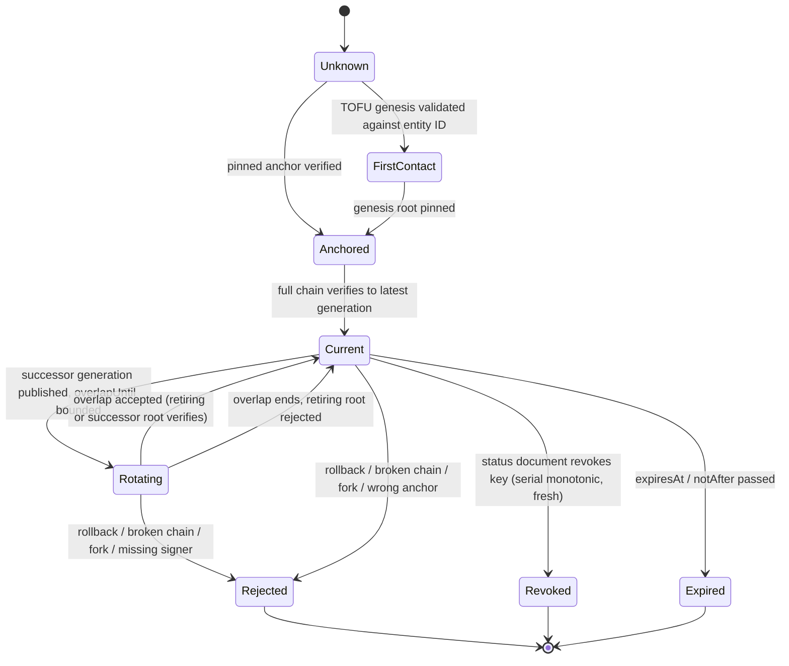

# Identity key lifecycle profile — xeip.identity-key-lifecycle/0.2 (design draft)

**Status: partially implemented (reference slices); the full profile is design.** This document is a design draft for the key-distribution, trust-root, rotation, revocation and recovery work tracked by [issue #1](https://github.com/powerpuff-kitty/XEIP/issues/1), building on the signed-envelope slice ([ADR 0009](decisions/0009-local-signed-envelopes.md)). RFC 2119 / RFC 8174 keywords describe the **proposed** profile; the following slices are implemented and tested in JS and Rust with shared conformance vectors (see the plan records under `spec/plans/`):

- `xeip.keydoc/0.1` signed key documents, chain verification, rollback/fork/gap rejection, and fail-closed trust anchors with opt-in bounded TOFU (`tools/key-document.mjs`, `crates/xeip-identity`) — [plans/identity-keydoc.md](plans/identity-keydoc.md).
- `xeip.status/0.1` signed revocation/status documents with monotonic `serial` and bounded staleness, plus a `StatusTracker` (`tools/identity-status.mjs`, `crates/xeip-identity`) — [plans/identity-status.md](plans/identity-status.md).
- `xeip.device-rotation/0.1` root-endorsed device rotation with a bounded overlap and a `DeviceRotationTracker` (`tools/identity-device-rotation.mjs`, `crates/xeip-identity`) — [plans/identity-device-rotation.md](plans/identity-device-rotation.md).
- The reference relay resolves a signed envelope's `kid` against trusted key documents and rejects revoked kids (`createRelay({ signatures, keyDocuments, statusDocuments })`).

Still **design-only**: root-rotation signature rules and recovery, revocation/status distribution and live-stream termination, directory discovery, durable fork/equivocation evidence, and independent review.

It builds on, and does not replace, three things that already exist:

- the self-certifying key-ID codec in [`tools/derive-keyid.mjs`](../tools/derive-keyid.mjs)
  and [`crates/xeip-identity`](../crates/xeip-identity), with vectors under
  [`conformance/fixtures/identity-keyid/`](../conformance/fixtures/identity-keyid/)
  ([plan](plans/identity-key-encoding.md));
- the detached-Ed25519 signed-envelope verification slice in
  [`tools/signed-envelope.mjs`](../tools/signed-envelope.mjs) and
  [`crates/xeip-identity/src/lib.rs`](../crates/xeip-identity/src/lib.rs), spec'd
  in [local-signed-envelopes.md](local-signed-envelopes.md);
- the identity model and open questions in [identity.md](identity.md) §2–§6 and
  §11, and the residual threat-model risks T2 (impersonation / stolen
  credentials) and T6 (parsing ambiguity before signing) in
  [threat-model.md](threat-model.md).

The signed-envelope slice proves possession of the key named by a `kid`, but it
explicitly does **not** prove that the `kid` belongs to the entity in `sender`
([local-signed-envelopes.md](local-signed-envelopes.md), "What a signature does
and does not prove"). This profile is what closes that gap. It agrees with
[security.md](security.md) (identity binding, no custom crypto) and
[ADR 0004](decisions/0004-verifiable-identity.md),
[ADR 0007](decisions/0007-crypto-dependencies.md).

## 1. Scope and relationship to the signed-envelope slice

The signed-envelope profile answers *"did the holder of the key in `kid` sign these
bytes?"*. This profile answers the prior questions:

- *Which entity does `kid` belong to, and how does the verifier know?*
- *Is that key current, endorsed, unrevoked and within its validity?*
- *What happens when a root or device key rotates or is compromised?*
- *What can be recovered, and what explicitly cannot?*

Applying this profile is a verifier-side composition: a verifier first resolves
`kid` → entity through a trusted key document (§7–§8), then runs the existing
signed-envelope verification. Neither step grants authorization, membership or
admission; those remain separate profiles ([identity.md](identity.md) §9).

## 2. Roles and terms

| Term | Meaning | Key held |
| --- | --- | --- |
| Entity (principal) | Stable, key-derived identity `urn:xeip:entity:<key-id>` | Entity **root** key |
| Genesis key | The root key of generation 0; its key-ID defines the entity ID | No (it is the first root) |
| Root key | The entity key authorized to sign key documents for one generation | Yes (offline recommended) |
| Device key | Operational key that authenticates a device and signs envelopes | Yes (on device) |
| Key document | Signed, versioned map from an entity ID to its current root and endorsed device keys | Contains no private key |
| Key document chain | Ordered list of generations from genesis to the current document | — |
| Status document | Signed, serialized list of revoked key-IDs for an entity | — |
| Trust anchor | The out-of-band fact a verifier starts from (pinned or self-certifying genesis) | — |

Every identifier component is the key-ID encoding of
[identity.md](identity.md) §2 (`z` + base58btc + `0xed01` multicodec + 32 raw
Ed25519 bytes). A verifier MUST decode and canonical-check every `kid` before
using it, using the existing codec; a key supplied in a document field is never
trusted until it matches its own key-ID and is reached from a verified anchor.

## 3. Key document format

A key document is a canonical-JSON object (RFC 8785) with a detached Ed25519
signature carried in a `signatures` member. The draft carrier is:

```json
{
  "profile": "xeip.identity-key-lifecycle/0.2",
  "type": "xeip.key-document",
  "entity": "urn:xeip:entity:<genesis-key-id>",
  "generation": 0,
  "previous": null,
  "root": { "alg": "EdDSA", "kid": "<key-id>" },
  "devices": [
    {
      "alg": "EdDSA",
      "kid": "<key-id>",
      "notBefore": "2026-10-01T00:00:00Z",
      "notAfter": "2027-10-01T00:00:00Z"
    }
  ],
  "issuedAt": "2026-10-01T00:00:00Z",
  "expiresAt": "2027-10-01T00:00:00Z",
  "overlapUntil": null,
  "extensions": {},
  "signatures": [
    { "alg": "EdDSA", "kid": "<key-id>", "sig": "<canonical unpadded base64url>" }
  ]
}
```

Field rules:

- `profile` MUST be exactly `"xeip.identity-key-lifecycle/0.2"` and `type` MUST be
  exactly `"xeip.key-document"`; any other value is rejected before parsing.
- `entity` is the entity URI whose `key-id` is derived from the **genesis** root
  key, never from the current root. It stays constant for the entity's lifetime
  ([identity.md](identity.md) §2).
- `generation` is a non-negative safe integer, monotonic per entity. Generation 0
  is the genesis document.
- `previous`, when present and non-null, is the content digest of the immediately
  preceding key document: `"sha256:" + base64url(SHA-256(RFC8785(previous_doc_without_signatures)))`.
  It MUST be `null` for generation 0 and MUST be non-null for every generation > 0.
- `root` names the root key for this generation.
- `devices` lists endorsed device keys with explicit validity bounds. An empty
  array is valid (an entity with no active device). Validity bounds MUST be
  inclusive UTC instants and MUST satisfy `notBefore < notAfter`.
- `issuedAt` and `expiresAt` bound the document's own validity. `expiresAt` MUST be
  present and MUST be greater than `issuedAt`.
- `overlapUntil` is required to be non-null only when `generation > 0` **and** the
  root key changed from the previous generation (§5); otherwise it MUST be `null`.
- `extensions` is an object for forward-compatible, profile-versioned additions.
  Unlike the envelope profile, `extensions` **is covered by the signature** (the
  envelope excludes it only because its signature carrier lives there; here the
  carrier is `signatures`).
- `signatures` is the only member excluded from the signing input.

A document MUST be rejected if it carries unknown members, unknown `alg` values,
duplicate JSON member names, lone surrogate escapes, non-finite numbers or
integers outside ±(2^53−1), under the same strict pre-parse gate as
[local-signed-envelopes.md](local-signed-envelopes.md) and
[ADR 0007](decisions/0007-crypto-dependencies.md). No Unicode normalization is
performed.

## 4. Signing input and verification of a single document

The bytes signed are:

```
UTF-8( RFC8785( key_document_without_signatures ) )
```

Concretely, remove the `signatures` member in its entirety, canonicalize the rest
with RFC 8785, encode as UTF-8, and verify each signature with Ed25519 (RFC 8032)
over those exact bytes. `signatures` MUST contain at least the required signer set
(§5) and each entry's `sig` MUST be canonical, unpadded base64url of exactly 64
bytes. `alg` MUST be exactly `"EdDSA"`; `alg: "none"`, algorithm substitution and
any header- or field-supplied key material/fetch URL MUST be rejected. There is no
`jwk`, `jku` or `x5u` concept here; keys are always resolved from `kid` and the
verified chain.

A verifier MUST reject a document whose signature does not verify (stable reason
`bad signature`) and MUST NOT fall back to trusting an unsigned or partially
signed document.

## 5. The chain: genesis, generations, rotation, overlap, rollback

### 5.1 Genesis and self-certification

Generation 0 MUST contain exactly the required signature by its own `root.kid`, and
the verifier MUST check:

```
entity == "urn:xeip:entity:" + key-id(root.kid)
```

A mismatch is a `wrong anchor` failure. Because the entity ID commits to the
genesis key, the genesis document is **self-certifying**: a verifier that already
knows the entity ID can check the genesis root without any directory. What the
entity ID does not commit to is later generations, which is what the chain supplies.

### 5.2 Rotation and required signatures

For generation `N > 0`, let `prev` be the accepted document at generation `N-1`.
A verifier MUST reject the candidate unless all of the following hold:

1. `candidate.generation == prev.generation + 1`.
2. `candidate.previous == digest(prev)`.
3. `candidate.issuedAt >= prev.issuedAt`.
4. `candidate.entity == prev.entity`.
5. The candidate's `signatures` include a valid signature by `prev.root.kid` (the
   **retiring** root).
6. The candidate's `signatures` include a valid signature by `candidate.root.kid`
   (the **successor** root), **unless** the successor key was already an active
   root or listed active device in `prev` — in which case that endorsement is
   sufficient and the retiring signature alone is required, matching
   [identity.md](identity.md) §6.
7. If the successor key is unchanged from `prev`, rule 6's endorsement path applies
   and `overlapUntil` MUST be `null`.

Extra signatures MAY be present and MUST be ignored unless they are in the required
set. The list of required signers is derived from `prev`, never from the candidate.

### 5.3 Bounded overlap

When the root key changes, the retiring root remains accepted for a **bounded
overlap** window:

- `overlapUntil` MUST be present, MUST be greater than `candidate.issuedAt`, and
  MUST NOT exceed `candidate.issuedAt + max_overlap`, where `max_overlap` is a
  deployment-configured bound (the profile does not fix a default; a deployment
  that does not configure one MUST use zero overlap).
- During `[candidate.issuedAt, overlapUntil]` a verifier MAY accept either the
  retiring or the successor root for authenticating envelopes and for signing the
  next generation.
- After `overlapUntil`, a verifier MUST reject any document or envelope signed by
  the retiring root as `expired document` / `revoked key` as appropriate.
- There is no open-ended acceptance of a retired root.

### 5.4 Generation rollback and forks

A verifier that follows a chain MUST persist, per entity, the highest accepted
generation, its digest and its `issuedAt`, under the entity ID (bound to the trust
anchor in §7). It MUST reject as `generation rollback` any candidate whose
`generation` is less than or equal to the stored generation, or whose `previous`
does not equal the stored digest. A verifier MUST verify every link from its trust
anchor; a candidate MAY only be accepted out of order if the complete chain from
the anchor is available and consistent, otherwise it MUST fail closed. A verifier
SHOULD reject non-monotonic `issuedAt` as `generation rollback` (clock-skew
tolerance is an open question, §17).

**Equivocation / forks.** If two distinct documents at the same generation, or two
distinct successors to the same `previous` digest, both verify, the root key has
double-signed. A verifier MUST detect this where it can (by comparing digests of
same-generation documents it has seen) and MUST treat the entity as suspect and
fail closed rather than choosing one. This is an explicit detection limit, not a
complete prevention; durable fork evidence needs a conflict store (§17).

## 6. Device endorsement and device rotation

- A device is endorsed by appearing in the `devices` array of a root-signed key
  document. That entry **is** the endorsement; there is no separate device
  certificate. The device's ID is `urn:xeip:device:<key-id>`.
- A verifier MUST reject an envelope whose `kid` is not the current root, the
  retiring root within a bounded overlap, or an active endorsed device within its
  `notBefore`/`notAfter` window (stable reason `unknown device` or `device not
  endorsed`). An endorsed device is active only when `notBefore <= now <= notAfter`.
- A device key rotation MAY be expressed either as a new key-document generation
  that endorses the new key and drops the old, or as a standalone rotation
  statement signed by the old device key and the current root key:

  ```json
  {
    "profile": "xeip.identity-key-lifecycle/0.2",
    "type": "xeip.device-rotation",
    "entity": "urn:xeip:entity:<genesis-key-id>",
    "old": "<old key-id>",
    "new": "<new key-id>",
    "issuedAt": "2026-10-01T00:00:00Z",
    "notAfter": "2026-12-31T00:00:00Z",
    "signatures": [
      { "alg": "EdDSA", "kid": "<old key-id>", "sig": "..." },
      { "alg": "EdDSA", "kid": "<current root key-id>", "sig": "..." }
    ]
  }
  ```

  The same `signatures`-removal signing input applies. A verifier MUST require both
  signatures, MUST accept only new envelopes under `new` after `notAfter`, and MUST
  apply the same bounded overlap rule. A rotation statement is only meaningful
  under a trusted key document for the entity; it is not itself an anchor.
- Devices MUST NOT sign key documents. Root-signing delegation to a device is a
  separate, audited delegation record and is **out of scope** here
  ([identity.md](identity.md) §1, §11.6).

## 7. Obtaining and trusting a key document

A key document is a signed claim, not authority by itself. The profile defines
three trust roots and MUST fail closed when none is configured for a claim that
needs one ([identity.md](identity.md) §3).

### 7.1 Pinned anchor (recommended)

An operator configures, out of band:

```
{ entity, genesis_root_kid, [max_generation], [pinned_digest] }
```

A verifier resolves the chain from `genesis_root_kid`, checks §5 at every step,
and accepts only a generation `<= max_generation` when configured. A `pinned_digest`
short-circuits to a known current document. This is the only model that should be
called "verified identity" and is the default for organizations and hosted
deployments.

### 7.2 Self-certifying genesis with first contact (TOFU), bounded

Because the entity ID commits to the genesis root key, a verifier can validate a
received genesis document against the entity ID without any directory. "First use"
therefore only decides *whether to begin trusting an entity at all*, not *which
key the ID means*. On first contact a verifier MAY cache `(entity, genesis_root_kid)`
and thereafter MUST treat the genesis root as pinned and apply §5 rotation only.
TOFU behavior:

- MUST NOT be presented to applications as verified identity
  ([identity.md](identity.md) §3);
- MUST be recorded as a distinct trust level, not conflated with a pinned anchor;
- MUST have revocation (§9); and
- MUST fail closed if a later document's genesis root differs from the pinned one
  (`wrong anchor`).

### 7.3 Inline bootstrap (directory-free)

A sender that has never been seen MAY deliver its genesis document, or a full chain,
alongside an envelope or through discovery. The delivery framing is a transport or
application concern and is out of scope; whatever the framing, the verifier MUST
apply §4, §5 and this section and MUST NOT treat mere receipt as trust. Discovery
records remain self-asserted until this verification succeeds
([discovery.md](discovery.md), [identity.md](identity.md) §3).

### 7.4 Unsupported

An unsigned document, a document with no anchor and no verifiable genesis, an
unpinned network-fetched document, or any document whose root key is not reached
from a trusted anchor is **not authority**. A verifier MUST fail closed rather than
accepting it.

## 8. Binding a signed envelope's `kid` to an entity

The composition rule for an envelope signed under
[local-signed-envelopes.md](local-signed-envelopes.md):

1. Parse the envelope under the strict pre-parse gate.
2. Read `extensions["xeip.sig"].kid` and decode/canonical-check it with the
   key-ID codec; reject `unsupported algorithm` unless `alg` is `EdDSA`.
3. Resolve `envelope.sender` to a trusted key document set (§7). If no trusted key
   document exists for the entity, the envelope MAY be integrity-checked but MUST
   NOT be treated as identity-bound; the profile's stable reason is `unknown entity`.
4. Verify `kid` is the current root, the retiring root within overlap, or an active
   endorsed device in the resolved document (`unknown device` / `device not
   endorsed` otherwise).
5. Verify the document and, where required, the status document are current and
   not revoked (§9).
6. Run the existing signed-envelope verification, including its
   `entityUrn(kid) === sender` binding.

Step 3 is exactly the missing piece called out in
[local-signed-envelopes.md](local-signed-envelopes.md): this profile supplies the
`kid` → entity mapping that the signature alone cannot.

## 9. Revocation and status documents

### 9.1 Status document

```json
{
  "profile": "xeip.identity-key-lifecycle/0.2",
  "type": "xeip.key-status",
  "entity": "urn:xeip:entity:<genesis-key-id>",
  "serial": 12,
  "generation": 3,
  "issuedAt": "2026-10-01T00:00:00Z",
  "expiresAt": "2026-10-02T00:00:00Z",
  "nextUpdate": "2026-10-01T12:00:00Z",
  "revoked": [
    { "kid": "<key-id>", "revokedAt": "2026-09-30T00:00:00Z", "reasonCode": "keyCompromise" }
  ],
  "extensions": {},
  "signatures": [
    { "alg": "EdDSA", "kid": "<entity root key-id>", "sig": "..." }
  ]
}
```

Rules:

- `serial` is a monotonic safe integer per entity. A verifier MUST reject a status
  document whose `serial` is less than or equal to the highest serial it has
  accepted for that entity (stable reason `status rollback`) unless a newer root
  generation re-anchors it; this prevents replay of an old "clean" status.
- A status document MUST be signed by a root key of the entity at generation
  `>= generation` (or the root of the referenced generation), verified against the
  chain of §5.
- `expiresAt` and `nextUpdate` bound staleness. A verifier MUST reject an expired
  or past-`nextUpdate` status document (`stale status`) and MUST treat "no fresh
  status" as **unknown**, never as "not revoked". A deployment MUST configure a
  maximum staleness; beyond it, identity binding fails closed.
- `reasonCode` SHOULD use established reason codes (for example RFC 5280
  `keyCompromise`, `cessationOfOperation`, `superseded`, `unspecified`). Reason
  values MUST NOT be public by default (§12).
- Revoking a `kid` in a status document MUST cause that key to fail new
  authentication and MUST terminate existing authenticated streams that used it,
  mirroring the local `revokeCredential` semantics in
  [local-admission.md](local-admission.md).

### 9.2 Live-stream implications and honest limits

- **Relay-enforced/local deployments.** When the relay holds the trusted chain and
  status, a learned revocation closes affected authenticated streams (the
  "revoked credentials cannot reconnect / live streams terminate" criterion).
- **Hosted end-to-end (`tls-jws`).** The signed-envelope profile has no
  authenticated long-lived stream and no global directory
  ([local-signed-envelopes.md](local-signed-envelopes.md)). A recipient MUST
  consult a status document; revocation therefore takes effect on the next status
  check, not instantaneously, and a stream that predates a revocation may continue
  until then. This is stated as a limitation, not solved.
- **No durable, globally visible revocation without a central authority.** Status
  is best-effort and per-verifier. A fresh status document that omits a revoked key
  cannot be distinguished from an old one except by `serial`, `issuedAt` and
  signature; that is the bound of what this draft offers. Durable decentralised
  revocation remains open (§17).

## 10. Short-lived credentials

Short validity is the primary revocation control where no reliable status
distribution exists:

- Device endorsements SHOULD use short `notAfter` bounds (shorter than the root
  document's `expiresAt`).
- Hosted deployments SHOULD issue short-lived signed credentials (for example a
  JWS with a bounded `exp` and a `kid` resolving through this profile) so that a
  missed revocation expires quickly.
- A verifier MUST enforce `notBefore`/`notAfter`/`expiresAt`; an expired device key
  is treated like a revoked key for new connections, even if no status document
  says so.
- Short validity reduces, but does not remove, the need for status: compromise
  within the validity window still requires revocation propagation.

## 11. Recovery

Recovery is described honestly, including what cannot be done.

Achievable without a central authority:

- **Lost device key.** Re-enroll by publishing a new key-document generation (or a
  root-endorsed device-rotation statement) that endorses a new device key. The
  entity ID is unchanged; the lost device is dropped or left to expire.
- **Compromised device key.** Revoke the device `kid` in a status document and/or
  stop endorsing it in the next generation; other devices are unaffected. The
  overlap window (§5.3) applies only to root rotation, not to device revocation.
- **Lost or compromised root key with a surviving higher-generation root.** If a
  previous generation already endorsed a successor root that is not compromised,
  recovery uses that root to publish a new generation and revoke the compromised
  one. If the successor is itself compromised, there is no recovery.

Explicit non-goals for this draft:

- **No root-key recovery.** Loss of the current root with no surviving endorsed
  successor has **no protocol-level recovery**. The genesis key defines the entity
  ID, so any "recovery" that introduces a new genesis key produces a **new
  identity**; it is not identity continuity. An operator may re-anchor a new
  genesis out of band, but that is an explicit new identity, not recovery.
- **No threshold, social, custodial or escrow recovery.** These are not designed
  here and MUST NOT be simulated by weakening signature or chain checks. A future
  design MUST NOT silently weaken authentication to recover an identity
  ([identity.md](identity.md) §10).
- **No recovery of revoked material.** A revoked key cannot be un-revoked by this
  profile; issuing a new key and a new status serial is the only path.

## 12. Privacy, correlation and disclosure

Self-certifying identifiers are correlation-capable; this profile does not claim
unlinkability ([identity.md](identity.md) §10).

- **Allowed by default:** the entity ID, the current root and device public keys,
  the current generation and profile/version labels.
- **MUST NOT be public by default:** private keys; device credentials; session
  membership, presence and connection counts; message bodies; and **revocation
  reasons**. A status document SHOULD be obtainable only through an authenticated
  channel or be reduced to the minimum ("this `kid` is revoked") without reason.
- **Correlation consequences.** A stable entity ID links all of an entity's
  activity across sessions and devices regardless of key rotation. Device key
  rotation unlinks *device* correlation but not *entity* correlation. Publishing
  full chain history exposes rotation timing, device counts and compromise windows;
  verifiers SHOULD retain only the current and immediately previous generation
  unless a deployment needs history.
- **Discovery.** Key-document discovery SHOULD be opt-in and privacy-preserving,
  consistent with [discovery.md](discovery.md) and [identity.md](identity.md) §7.
- **Status privacy.** A public status document leaks which keys were revoked and
  when. Deployments SHOULD serve status privately per-entity rather than in a
  global directory.

## 13. State machine



## 14. Conformance-vector proposals

Deterministic vectors would live under
`conformance/fixtures/identity-keydoc/` (new; not yet committed) and be consumed by
the JavaScript reference, `crates/xeip-identity` and (later) the TypeScript SDK, so
both languages prove byte-identical signing input and identical `valid`/`reason`
results, exactly as `conformance/fixtures/identity-signed/signed.vectors.json`
does today. Each entry carries `{ name, valid, reason?, document?, anchor?,
status?, envelope? }` with stable reason strings.

Positive:

| Name | Proves |
| --- | --- |
| `genesis.valid` | Self-certifies: `entity == urn:xeip:entity:key-id(root.kid)`; one root signature |
| `chain.rotation.valid` | Generation 1 dual-signed by retiring + successor root; `previous` digest matches; bounded overlap |
| `chain.rotation.successor-preendorsed` | Successor already active in `prev`; retiring-only signature accepted |
| `device.endorsed` | Active device `kid` in a valid document binds an envelope `kid` to the entity |
| `device.rotation.valid` | Old+root-signed rotation statement; overlap bounded |
| `status.fresh` | Monotonic serial, fresh `nextUpdate`, valid root signature; revoked `kid` rejected, clean `kid` accepted |

Negative:

| Name | Stable reason |
| --- | --- |
| `genesis.wrong-anchor` | `wrong anchor` (entity ID does not match root key-ID) |
| `chain.broken` | `broken chain` (`previous` digest mismatch) |
| `chain.generation-rollback` | `generation rollback` (generation ≤ stored) |
| `chain.generation-skip` | `broken chain` (generation ≠ prev+1) |
| `chain.missing-successor-signature` | `missing successor signature` (dual sign required, absent) |
| `chain.fork` | `fork detected` (two documents, same generation, distinct digests) |
| `doc.bad-signature` | `bad signature` |
| `doc.alg-substitution` | `unsupported algorithm` (`alg` ≠ `EdDSA`) |
| `doc.unsigned` | `unsigned document` |
| `doc.expired` | `expired document` |
| `device.unknown` | `unknown device` (envelope `kid` not in document) |
| `device.not-endorsed` | `device not endorsed` (outside `notBefore`/`notAfter`) |
| `status.rollback` | `status rollback` (serial ≤ stored) |
| `status.stale` | `stale status` (`nextUpdate`/`expiresAt` passed) |
| `status.revoked-kid` | `revoked key` (envelope `kid` listed revoked) |

A shared `identity-keydoc` harness (analogous to the signed-envelope tests) MUST
reproduce these bytes and reasons before the profile can be called interoperable.

## 15. Non-goals

This draft does not design or claim:

- A certificate authority, global PKI, mandatory directory or federation registry.
- Durable, globally consistent or instantaneous revocation propagation.
- Root-key recovery, or threshold, social, custodial or escrow recovery.
- Cross-entity delegation (a device acting for multiple entities) or scoped
  capability grants.
- Anonymous or unlinkable identities; self-certifying IDs are correlation-capable.
- End-to-end encryption, forward secrecy beyond TLS, or metadata protection.
- Post-quantum migration.
- Production readiness, independent review or third-party interoperability.
- Any change to envelopes, schemas or implemented behavior. Key documents travel in
  versioned `extensions` or a separately versioned profile/frame so a v0.1 parser
  keeps rejecting unknown fields ([identity.md](identity.md) §8).

## 16. Mapping to issue #1's remaining acceptance criteria

[identity.md](identity.md) §12 is a plan, not a record of completion. This profile
addresses the criteria that the signed-envelope slice left open.

| Acceptance criterion | This profile's response | Evidence still required |
| --- | --- | --- |
| A cannot send as B | Resolve `kid` → entity through a trusted key document before accepting the signature; a key for A cannot appear in B's document, so `entityUrn(kid) === sender` fails for B (§8) | Negative vectors where A's trusted key signs `sender: B` and where B's document does not endorse the `kid`; Rust + TS |
| Revoked credentials cannot reconnect | Status documents revoke `kid`s; expiry and bounded staleness fail closed; relay profiles terminate affected live streams (§9, §13) | Transition tests: revoke-then-connect and revoke-then-stream-close; stale/rolled-back status rejection; Rust + TS |
| Rust + TS identity-binding conformance | New `identity-keydoc` vectors consumed by `tools/*`, `crates/xeip-identity` and the future SDK identity layer, on top of the existing key-ID and signed-envelope vectors | New vectors and cross-language harness cases; the current harness only proves local bearer enforcement, key-ID encoding and signed-envelope verification |
| No custom crypto | Key documents use Ed25519 + RFC 8785 + the existing key-ID codec; the audited-library and strict pre-parse rules of [ADR 0007](decisions/0007-crypto-dependencies.md) apply unchanged | Review checklist and dependency audit proving only audited libraries are used |

None of this is implemented. Issue #1 remains incomplete until the profile is
implemented, tested across both languages and reviewed, as
[security.md](security.md) requires.

## 17. Open questions

1. Status distribution: authenticated per-entity fetch, push, or a compact signed
   status that can be piggybacked on envelopes — and how to bound staleness without
   a central authority.
2. Genesis discovery: how a verifier learns the first key document without a
   directory, and whether inline bootstrap is standardized or left to transports.
3. Whether key documents should use the raw `signatures` carrier proposed here or a
   JWS/JWK encoding selected in [ADR 0007](decisions/0007-crypto-dependencies.md);
   JOSE is not yet a dependency.
4. `max_overlap` and clock-skew tolerance values, and whether `issuedAt`
   monotonicity is enforced strictly or with a tolerance.
5. Fork/equivocation evidence: where a conflict store lives and how long it is
   retained, given that this profile only detects forks it has already seen.
6. Recovery of the last root: is a future threshold or custodian scheme acceptable,
   and how would it avoid weakening the signatures this profile relies on?
7. Privacy of status and chain history: minimizing disclosure while keeping
   revocation effective.
8. Key-document size/nesting bounds and the resource limits a verifier enforces.
9. Whether status/documents are exposed as first-class envelope fields in a future
   envelope version once canonicalization is normative ([identity.md](identity.md)
   §8).
10. Post-quantum migration: whether the `alg`/`kid` structure leaves a clean path
    to a second key type.
