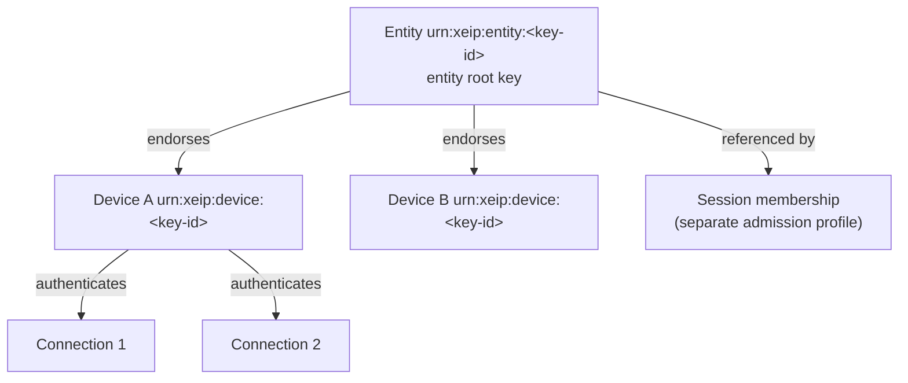
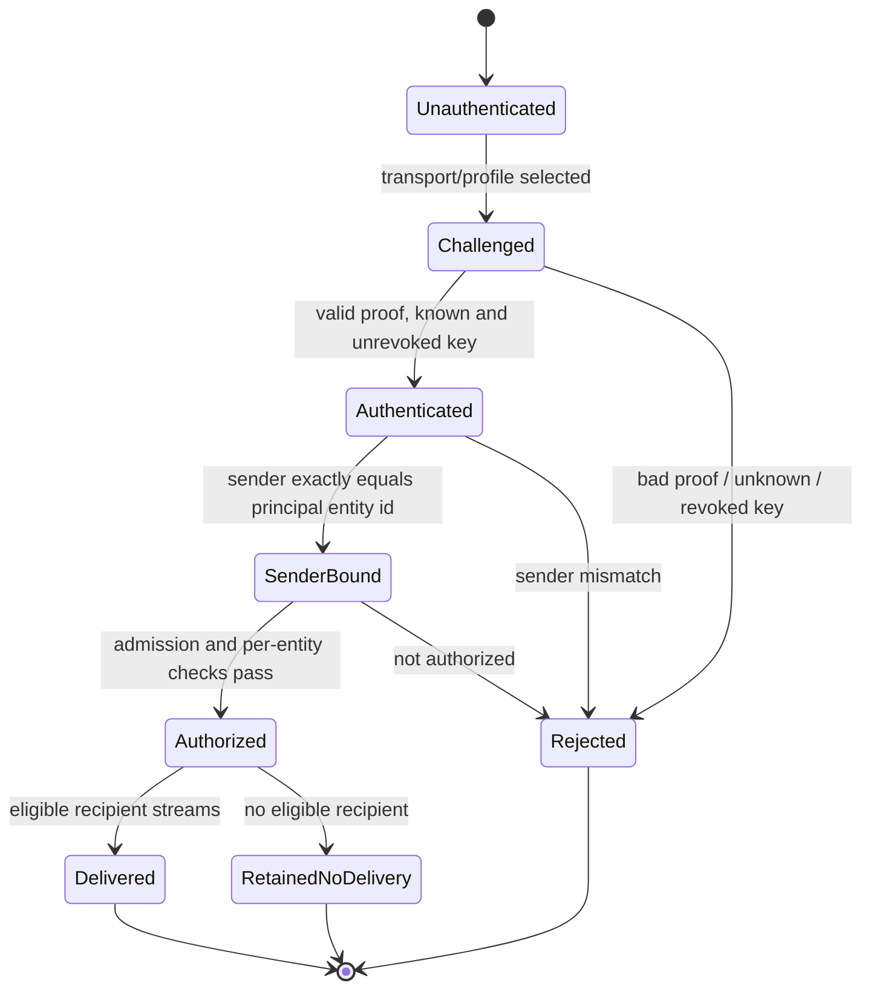
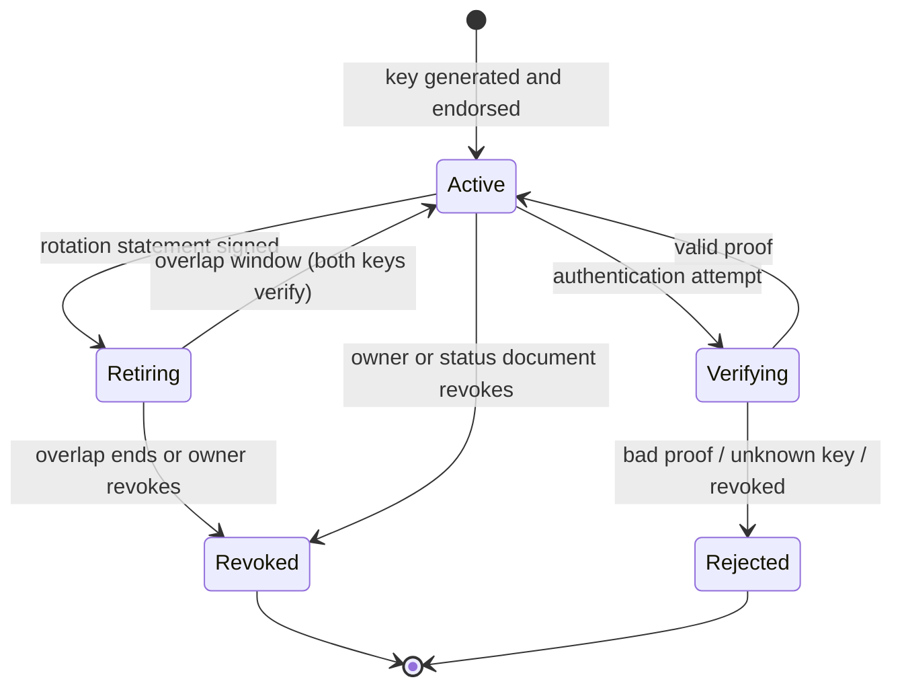
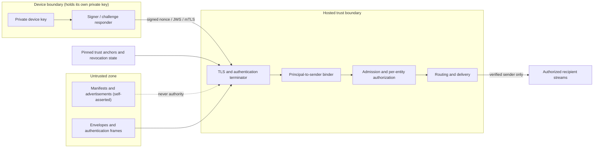

# XEIP verifiable identity and authentication — design draft 0.2

**Status: design only; not implemented.** This document is a non-normative design draft for the v0.2 identity work tracked by [issue #1](https://github.com/powerpuff-kitty/XEIP/issues/1). None of the key generation, trust roots, challenge/response, signature verification, rotation, revocation or recovery mechanisms described here exist in the repository. The base [envelope](core.md#5-message-envelope) still carries a self-asserted `sender` string, and the shared-token development mode and the opt-in [local admission profile](local-admission.md) remain the only implemented authentication. This draft is written at normative-draft quality so it can be reviewed and then implemented; RFC 2119 / RFC 8174 keywords describe the **proposed** profile, not current behavior.

It records the design intent, and [ADR 0004](decisions/0004-verifiable-identity.md) records the decision and alternatives. It agrees with [security.md](security.md) (identity binding, no custom crypto) and addresses the residual risks in [threat-model.md](threat-model.md) (T2 impersonation, T6 parsing ambiguity before signing).

## 1. Identity model

XEIP separates three things that are currently conflated by a claimed `sender` string: the **entity** (who), the **device** (which key holder is acting), and the **connection** (which ephemeral transport attachment delivered it). A session is a separate interaction context, not an identity.

| Concept | Lifetime | Proposed identifier | Key material | Authority |
| --- | --- | --- | --- | --- |
| Entity (principal) | Long-lived, stable across devices and sessions | `urn:xeip:entity:<key-id>` | Entity root key that endorses devices | The identity itself; unchanged by reconnection or display-name change |
| Device | Operational; one per install/process/credential store | `urn:xeip:device:<key-id>` | Device key | Acts for exactly one entity, within what that entity endorsed |
| Connection | Ephemeral transport attachment | None (transport-local correlation only) | Proof produced with a device key | No independent identity; reconnect MUST NOT mint a new entity |
| Session | Interaction context | `urn:xeip:session:<...>` | None | Membership and admission are enforced by a separate profile |

Rules for the proposed profile:

- An entity MAY have zero or more devices; each device MUST authenticate with its own key.
- A device MUST be bound to exactly one entity. Acting for multiple entities requires multiple devices or an explicit, audited delegation that is out of scope here.
- A connection is authenticated by a device; it MUST NOT be presented to applications as an identity. [core.md](core.md#4-sessions) already states that reconnection MUST NOT automatically create a new entity identity.
- Session membership is a claim of participation, not a grant of authority. Capability advertisements and `kinds` continue to grant nothing.

## 2. Identifier scheme

An entity ID MUST NOT be a display name, an email address, a hostname, or any other replaceable presentation string. The proposed construction is a **self-certifying** URI whose identifier component is derived from key material:

- Entity: `urn:xeip:entity:<key-id>` — anchored to the entity's **genesis key document**, so the ID stays stable across root-key rotation (see §6).
- Device: `urn:xeip:device:<key-id>` — derived from the device's current public key.

`<key-id>` SHOULD be an established key-derived encoding rather than a new one. Prefer the W3C `did:key`-style construction `multibase(MULTICODEC(public-key-type, raw-public-key-bytes))` — a **multicodec**, not a multihash (a common misreading). Multibase base58btc (`z6Mk…`) and base64url are case-sensitive, so the design MUST name the exact alphabet rather than claiming "lowercase". A verifier recomputes the identifier from the advertised key and rejects a manifest whose key does not match its claimed ID. Before computing or comparing a key ID, the key bytes MUST be validated: expected length, valid curve point, and rejection of non-canonical encodings or small-order points per [RFC 8032](https://www.rfc-editor.org/rfc/rfc8032) §5.1.3.

For stable entity IDs, `<key-id>` is derived from the **genesis key** recorded in the entity's first signed key document, not from the current root key, so rotating the root key does not change the entity ID (see §6). Device IDs remain key-derived; a device key rotation issues a new device ID endorsed by the entity, which is acceptable because the entity ID — not the device ID — is the stable principal. A client that keeps no key document cannot verify rotation and MUST treat subsequent keys as a different identity unless a pinned anchor says otherwise.

Consequences:

- The `name` field in [entity.schema.json](../schemas/entity.schema.json) remains an optional presentation label. Two entities MAY share a name, a name MAY change without changing the ID, and a name MUST NOT be used for routing, membership or authorization.
- A human-chosen ID such as `urn:xeip:entity:agent` is not self-certifying. The proposed profile MUST treat such IDs as opaque labels that carry no proof; binding them to a key requires an explicit trust anchor (see §3).
- [core.md](core.md#1-scope) causes the current implementation to compare identifier strings exactly and forbids normalization. This draft does not change that behavior; a v0.2 identity profile would define a canonical, key-derived representation and, separately, how that canonical representation is bound to authenticated identity, as [core.md](core.md#1-scope) anticipates.
- Key-derived IDs use a single canonical encoding; the exact alphabet and normalization rules are fixed with the codec in §11. A parser MUST reject percent-encoded or otherwise non-canonical variants rather than silently normalizing them, so that `urn:xeip:entity:%61...` and its canonical form cannot both be accepted as the same principal.
- A reference, dependency-free key-ID encoder now exists in [`tools/derive-keyid.mjs`](../tools/derive-keyid.mjs) (Ed25519 multicodec `0xed01` + base58btc `z`), with deterministic vectors under `conformance/fixtures/identity-keyid/` and the plan in [plans/identity-key-encoding.md](plans/identity-key-encoding.md). Signing, verification and curve-point validation remain unimplemented.

## 3. Trust roots and verification of untrusted manifests

Entity manifests ([entity.schema.json](../schemas/entity.schema.json)) and discovery records ([discovery.md](discovery.md)) are self-asserted claims. A client MUST NOT treat a received manifest, advertisement, well-known document or endpoint URL as identity or authority by itself.

The proposed verification order is:

1. **Structural validation.** Reject malformed manifests using the existing schemas and validators ([../schemas/entity.schema.json](../schemas/entity.schema.json), [../crates/xeip-core/src/lib.rs](../crates/xeip-core/src/lib.rs), [../sdks/typescript/src/validation.js](../sdks/typescript/src/validation.js)).
2. **Self-certification.** Recompute `<key-id>` from the key carried by the manifest or its referenced key document and reject a mismatch. Because [entity.schema.json](../schemas/entity.schema.json) is closed (`additionalProperties: false`) with no key or signature field, key material, key documents and detached signatures MUST travel in a versioned `extensions` member (which the schema permits) or in an external, content-addressed document referenced from `extensions`; the exact canonical bytes signed and the key-document encoding MUST be defined before this step is normative.
3. **Anchor signature (optional).** If the deployment requires an organizational or directory attestation, verify a detached signature over the canonical manifest against a **pinned** trust anchor. Unpinned, self-referential or network-fetched anchors are not authority.
4. **Endpoint constraints.** Resolve advertised endpoints only under the SSRF and metadata-leakage constraints required by [security.md](security.md#required-production-protections-local-prototypes-are-incomplete) item 7. Never fetch or execute code from a manifest field.

The profile distinguishes trust roots explicitly and MUST fail closed when none is configured for a claim that needs one:

- **Self-certifying root:** the key-derived ID itself; the default for direct, directory-free use.
- **Pinned anchor:** an operator-configured public key or certificate; supports organizations and rotation via signed key documents (§6).
- **Unsupported:** a trust-on-first-use cache is acceptable for local experiments but MUST NOT be described as verified identity, and MUST have revocation.

## 4. Binding the authenticated principal to `sender`

Authentication establishes a principal `(entity_id, device_id, key_id)` before any envelope is accepted. The proposed rules are:

- The authenticated principal's `entity_id` MUST exactly equal the envelope `sender` (after the canonical representation of §2 is defined). Comparison is exact string comparison; no case folding, percent-decoding or resolution.
- A mismatch between an authenticated principal and `sender` MUST be rejected and MUST NOT be routed. This generalizes the sender-spoof denial already implemented locally in [local-admission.md](local-admission.md#authentication-and-authorization).
- An unauthenticated request MUST NOT be accepted, and a rejected authentication MUST NOT fall back to another mode (see §8).
- The device identity MAY travel in an `extensions` entry for audit or reply targeting, but it MUST NOT replace or override `sender` and MUST NOT be trusted until verified.
- A recipient MUST NOT assume that `sender` was bound to a principal merely because the envelope arrived at a relay. End-to-end binding requires the sender-side signature profile of §5; a verifying recipient that does not control the relay depends on that signature.
- A valid authenticated `sender` does not make application fields evidence: `replyTo`, `kind:"receipt"` and `extensions` remain application claims. A recipient MUST apply its own audience check (the envelope must name an authorized recipient for the session) and MUST NOT treat a receipt or reply correlation as proof of processing or authorization.

## 5. Authentication profiles

No custom cryptography is permitted. The profile MUST build only on reviewed standards and audited library implementations:

| Purpose | Proposed standard |
| --- | --- |
| Signature algorithm | Ed25519 ([RFC 8032](https://www.rfc-editor.org/rfc/rfc8032)) via an audited library |
| Ed25519 in JOSE (JWS `EdDSA`, JWK `OKP` key type) | [RFC 8037](https://www.rfc-editor.org/rfc/rfc8037) |
| Token / signature container | JWS compact or detached ([RFC 7515](https://www.rfc-editor.org/rfc/rfc7515)) |
| Key encoding | JWK ([RFC 7517](https://www.rfc-editor.org/rfc/rfc7517)) or the §2 key-id codec |
| Key ID via JWK thumbprint (if used) | [RFC 7638](https://www.rfc-editor.org/rfc/rfc7638) |
| Canonical bytes before signing | JSON Canonicalization Scheme ([RFC 8785](https://www.rfc-editor.org/rfc/rfc8785)) |
| Hosted channel security | TLS 1.3 ([RFC 8446](https://www.rfc-editor.org/rfc/rfc8446)); client certificates ([RFC 5280](https://www.rfc-editor.org/rfc/rfc5280)) where mTLS is used |
| HTTP request signing (optional) | HTTP Message Signatures ([RFC 9421](https://www.rfc-editor.org/rfc/rfc9421)) |

Two profiles are proposed:

- **`xeip.auth.local-challenge/0.2` (local transports).** For loopback [HTTP + SSE](transports/http-sse.md) and [WebSocket](transports/websocket.md) development deployments, the server issues a random, single-use, short-lived nonce. The device signs a fixed transcript (nonce, entity ID, device ID, server origin, profile version, expiry) using Ed25519 and returns it as a JWS. The server verifies the signature against the endorsed device key, checks nonce freshness and single use, and then binds the connection to `(entity_id, device_id)`. The challenge request/response framing, the JWS protected header (`alg` MUST be `EdDSA` and `kid` MUST identify the presented device key) and the transcript serialization MUST be defined by the profile; a verifier MUST reject `alg:none`, algorithm substitution and any transcript whose key does not match the endorsement. The principal `(entity_id, device_id)` MUST be derived from the verified endorsement of the presented key, not from fields inside the signed transcript; transcript values are only cross-checked. The nonce MUST NOT be reused, MUST be bound to the connection/transcript, and MUST expire. This replaces the bearer credential as the proof of possession while allowing a provisioned credential to bootstrap device enrollment.
- **`xeip.auth.tls-jws/0.2` (hosted transports).** TLS 1.3 secures the channel; mTLS, when used, binds the transport to a device certificate. Independently, the sender signs the canonical envelope as a detached JWS so that a relay cannot forge or alter content and so that end-to-end binding survives a relay that only holds transport authentication. The signature MUST cover the routing and identity fields (`id`, `sender`, `recipient`, `session`, `kind`, `timestamp`/`expiresAt`, and `replyTo` when present); a verifier MUST enforce a bounded freshness window and a replay cache keyed by `id`, since [core.md](core.md#5-message-envelope) treats `timestamp` as an unverified claim. A deployment MAY use mTLS alone between mutually known peers; a recipient that cannot trust the relay MUST require the envelope signature.

Because [core.md](core.md#5-message-envelope) states that the JSON wire format is **not** a canonical signing serialization, any signing profile MUST first define deterministic parsing: reject duplicate object names, unpaired surrogate escapes and numbers outside the interoperable range before canonicalization, rather than signing whatever a parser happened to produce. That is necessary but not sufficient: the rules MUST also state that no Unicode normalization is performed and MUST define `-0`, NaN and Infinity handling, consistent with [RFC 8785](https://www.rfc-editor.org/rfc/rfc8785), which itself maps `-0` to `0` and constrains numbers to IEEE-754 doubles. Canonicalization and duplicate-key handling are open questions in §11 and MUST be settled before signing is normative.

## 6. Rotation, revocation and recovery

- **Device key rotation.** A device MAY replace its key by presenting a rotation statement signed by the current device key and endorsed by the entity root key. Verifiers SHOULD accept a bounded overlap where both keys verify, then reject the retired key. The overlap window MUST be explicitly bounded and configured; there is no open-ended acceptance of a retired key.
- **Entity root key rotation.** The entity publishes a signed key document listing current device endorsements and a monotonic key generation, chained from the genesis key that defines the entity ID (§2), so rotation preserves the stable entity ID. A root rotation MUST be signed by both the retiring and the successor root key (or by the retiring key alone when the successor is already listed), and clients MUST reject generation rollback. Root-key rotation without out-of-band confirmation risks a compromised-key takeover; deployments MAY require an additional out-of-band or multi-signature confirmation. The signed key-document encoding and any overlap bound are open questions (§11).
- **Revocation.** Revocation MUST cause the affected key to fail authentication on new connections and MUST terminate existing authenticated streams, matching the local `revokeCredential` semantics in [local-admission.md](local-admission.md#trusted-owner-mutation-api). For local deployments, revocation is an in-process owner operation. For hosted deployments, short-lived authentication credentials (bounded validity) are the primary control, optionally backed by a signed revocation/status document. In the hosted `tls-jws` profile there is no authenticated long-lived stream and no durable, global revocation: a recipient of a signed envelope MUST consult a revocation/status document, so the "revoked credentials cannot reconnect" criterion is satisfied by relay-enforced profiles only. Durable, globally visible revocation without a central authority remains an **open question** (§11).
- **Recovery.** A lost device key MAY be re-enrolled by an authorized device or by the entity root key, which SHOULD be kept offline. Loss of the entity root key has **no protocol-level recovery** in this draft. Social, custodial and threshold recovery are explicitly non-goals and open questions; a future design MUST NOT silently weaken authentication to recover an identity.

## 7. Publicly discoverable metadata

Unless a deployment explicitly narrows it, the following MAY be public and are sufficient for another party to locate and verify a peer:

- The self-certifying entity ID and its public key(s) and key generations.
- `kinds`, advertised endpoints and capability IDs from a manifest (still self-asserted claims until §3 verification succeeds).
- Protocol, profile and application versions, and health responses that expose only profile labels and fixed resource bounds, as current health does in [local-replay.md](local-replay.md).

The following MUST NOT be public by default and MUST NOT be exposed by a relay's unauthenticated routes:

- Private keys, bearer tokens and any device credential material.
- Session membership lists, presence, connection counts and directory enumeration.
- Message bodies, timestamps beyond those already in the envelope, replay/delivery ledgers and revocation reasons.
- Which specific entities exist in a deployment when that is sensitive; self-certifying IDs make linkage analysis possible, so discovery SHOULD be opt-in and privacy-preserving, consistent with [discovery.md](discovery.md).

## 8. Migration from shared token and local admission

There is no silent upgrade path. Each deployment selects exactly one authentication mode at construction, and an authentication failure MUST NOT fall back to a weaker mode; [local-admission.md](local-admission.md#provisioning-and-trust) already forbids mixing admission and the shared token.

- **Shared development token.** Remains explicitly development-only and mutually-trusted. It MUST NOT be copied to production, exposed behind a reverse proxy, or represented as identity binding. It is the first thing to remove once a device-key profile is available.
- **Local admission bearer credentials.** This becomes a **bootstrap and enrollment** mechanism: the owner provisions an entity and may bind its first device key, or issue a one-time enrollment credential that a device exchanges for a key-bound principal. The bearer no longer proves identity by itself; it only authorizes enrollment. Existing behavior is preserved until the identity profile is implemented, and is not reinterpreted as verifiable identity in the meantime.
- **Wire compatibility.** The base envelope version stays `"0.1"` and its schemas are not changed by this draft. Identity material SHOULD travel in profile-versioned `extensions` or a new separately versioned profile/frame, so that a v0.1 parser continues to reject unknown fields rather than silently reinterpreting them. A future envelope version MAY add first-class signing fields once canonicalization is normative.

## 9. Trust boundaries

Authentication, sender binding, authorization and delivery are distinct boundaries. Passing one MUST NOT be presented as passing the next. Possession of an authenticated connection is not authorization to a session, and session membership is not permission to execute a command.

## 10. Non-goals

This draft does not design or claim:

- Any custom cryptographic primitive, encoding or challenge protocol.
- End-to-end encryption, forward secrecy beyond TLS, or metadata protection.
- A global PKI, a mandatory certificate authority or a single-vendor directory.
- Anonymous or unlinkable identities; self-certifying IDs are correlation-capable.
- Delegated capability grants, command authorization or approval workflows (separate work).
- Durable, globally consistent revocation or federation.
- Custodial, threshold or social recovery of a lost root key.
- Production readiness, independent review or third-party interoperability.

## 11. Open questions

1. Exact `<key-id>` codec and whether to use `urn:xeip:entity:` or a `did:xeip:` method; adopting `did:key`-style multicodec/multibase is preferred but unratified here.
2. Whether envelopes are signed end-to-end by default, or only authenticated at the relay, and how a recipient declares which it requires.
3. The precise canonicalization and duplicate-key/lone-surrogate/unsafe-number rejection rules, which MUST be fixed before any signing is normative.
4. A revocation distribution mechanism that stays decentralised and bounded.
5. Recovery semantics for a lost entity root key without weakening authentication.
6. Delegation scope and limits, where a device acts for exactly one entity (§1) and any broader authority is an explicit, audited delegation record rather than a device holding multiple identities.
7. Privacy of key discovery and the correlation risk of self-certifying IDs.
8. How canonical key-derived IDs coexist with the exact-string, no-normalization rule in [core.md](core.md#1-scope).
9. Backward compatibility for existing human-chosen IDs such as `urn:xeip:entity:agent`.
10. Whether a relay is required at all, or whether the same profiles apply peer-to-peer.

## 12. Mapping to issue #1 acceptance criteria

| Acceptance criterion | Proposed design response | Evidence still required |
| --- | --- | --- |
| A cannot send as B | Authenticate a device principal, then require exact `sender == entity_id`; reject mismatches (§4). | Negative conformance vectors where a trusted key for A signs an envelope with `sender: B`, across Rust and TypeScript. |
| Revoked credentials cannot reconnect | Revocation fails new authentication and terminates existing streams in relay-enforced profiles; hosted recipients additionally consult a revocation/status document (§6). | Transition tests for revoke-then-connect and revoke-then-stream-close in both implementations; a hosted revocation-status check. |
| Rust + TS identity-binding conformance | Shared canonical bytes, key encoding and JWS/sender-binding vectors consumed by a future `crates/xeip-identity` layer and the SDK identity layer (the primitive-free `xeip-core`/validation layers are not the home of crypto), summarized in [../conformance/README.md](../conformance/README.md). | New vectors and cross-language harness cases; the current harness only proves local bearer enforcement and the key-ID encoding (`tools/derive-keyid.mjs`, vectors under `conformance/fixtures/identity-keyid/`). |
| No custom crypto | Standards-only profile in §5 using Ed25519, JWS, JCS and TLS; custom primitives forbidden. | A review checklist and a dependency audit proving only audited libraries are used. |

This mapping is a plan, not a record of completion. Issue #1 remains incomplete until the profile is implemented, tested across both languages and reviewed, as [security.md](security.md#disclosure) requires.
