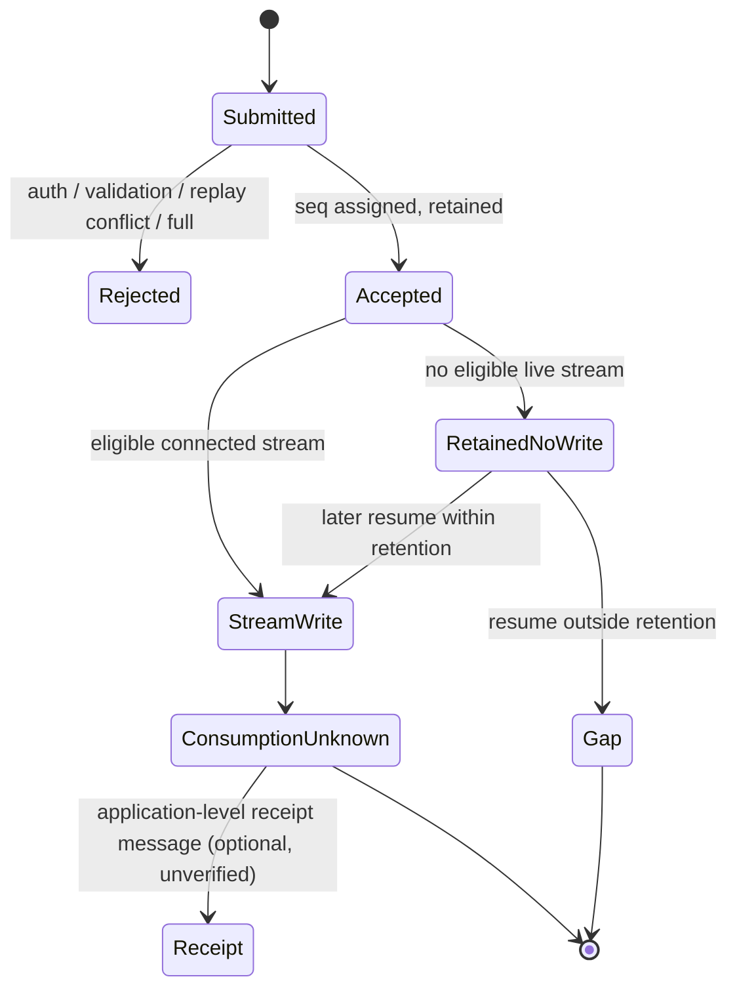

# Local delivery and resume profile — xeip.local-delivery/0.1

Experimental, in-memory sequencing extension for the [HTTP + SSE](transports/http-sse.md) and [WebSocket](transports/websocket.md) development transports, carrying unchanged XEIP `"0.1"` envelopes. It assigns a per-session delivery sequence, exposes it in transport framing, and lets a reconnecting subscriber resume from a cursor **within a bounded retention window**. It is not a durable queue, a recipient receipt or exactly-once execution. [ADR 0003](decisions/0003-local-delivery-resume.md) records the scope.

## Selection and limits

Enable explicitly through `createRelay({ token | admission, delivery: { windowMs: 300000, maxPerSession: 512, maxSessions: 256 } })`. `delivery: {}` uses those defaults. Unlike replay, delivery does not require admission mode; it only observes accepted, validated envelopes. Null, unknown option keys, non-integers and out-of-range values are errors. `windowMs` is 1–3600000 milliseconds, `maxPerSession` is 1–4096 and `maxSessions` is 1–1024. Configuration is copied. Both transports can be combined, and replay plus delivery can be enabled together.

Health adds `resumeProfile: "xeip.local-delivery/0.1"` and `resume: { windowMs, maxPerSession, maxSessions }` to the health response. The `deliveryProfile` field continues to describe the separate [replay](local-replay.md) ledger.

Run `npm run demo:delivery` for a self-contained simulated disconnect, cursor resume, gap detection and rejection of an unsupported cursor. It generates temporary credentials without printing them and cleans up its relay/streams.

## Sequence assignment

When delivery is enabled, the relay assigns a strictly increasing integer `seq` per session at acceptance, in the same synchronous step as routing, so the sequence order equals relay acceptance order. `seq` is transport framing, not part of the envelope; it is never added to the stored XEIP message.

- HTTP `POST /messages` returns `{ accepted: true, delivered: n, seq }`.
- HTTP/SSE frames carry `id: <seq>` before `event: xeip.message`.
- WebSocket `send` acceptance returns `{ type: "accepted", delivered: n, seq }` and live messages are delivered as `{ type: "message", seq, message }`.

A sequence is assigned only after authentication, validation, expiry and optional replay checks pass, and before any write. A replay-suppressed duplicate keeps its original sequence and receives no new one; its acceptance response carries `duplicate: true` and no `seq`. A message accepted with zero live subscribers still receives a sequence and is retained for resume.

## Resume

A subscriber may request a cursor:

- HTTP/SSE: send `Last-Event-ID: <seq>` or query `after=<seq>` (header wins). Both are non-negative integers without leading zeros.
- WebSocket: include `"after": <seq>` in the `subscribe` control.

The relay then replays retained envelopes with `seq` strictly greater than the cursor, filtered by the same session membership and recipient rules as live routing, and continues with live messages. Replayed entries use their original `seq` so a client can advance its cursor.

If the cursor predates the oldest retained entry for the session, the relay signals an explicit gap rather than silently skipping:

- HTTP/SSE: `event: xeip.gap` with `data` `{ "session": "...", "from": <oldestRetainedSeq> }`, written before the backlog.
- WebSocket: `{ "type": "gap", "session": "...", "from": <oldestRetainedSeq> }` before the replayed messages.

A cursor with no retained entries produces a gap only when earlier accepted messages were dropped; a cursor at or beyond the newest sequence produces nothing. A malformed cursor returns HTTP 400 (or a WebSocket `error` control with status 400). Supplying a cursor when the profile is not enabled returns 400.

## Retention, ordering and remaining limits

Retention is bounded per session by `maxPerSession` and by `windowMs` on a process-monotonic clock; the relay evicts the oldest entry within a session and the least-recently-used session when `maxSessions` is exceeded. Resuming counts as activity, so an actively resumed session is not evicted ahead of a colder one. If a session is evicted, a cursor below its last assigned sequence yields a gap, and a later message for that session continues the same monotonically increasing sequence. Retention is memory-only and is lost on process restart; a new relay factory does not restore a prior sequence or backlog.

These bounds count entries, not total bytes. Retained bodies may each approach the transport frame limit, so a process can retain substantially more memory than the entry count alone suggests; there is no total-byte budget.

Because a sequence is assigned once per acceptance on one relay, the per-session order is a total order of acceptance, which implies per-sender order for one sender. It does **not** establish sender local creation order, cross-relay order, or delivery/consumption order.

Relay acceptance, transport write, recipient receipt and application completion remain separate. A `receipt` kind or `replyTo` is still only application data/correlation; the relay does not verify consumption, and no automatic acknowledgment is sent. A disconnect after a queued write can still lose the message, and a message that aged out of retention cannot be resumed. There is no exactly-once execution, durable queue, message integrity or cross-relay resume. Use short-lived synthetic messages and a trusted local deployment. See [threat-model.md](threat-model.md).
