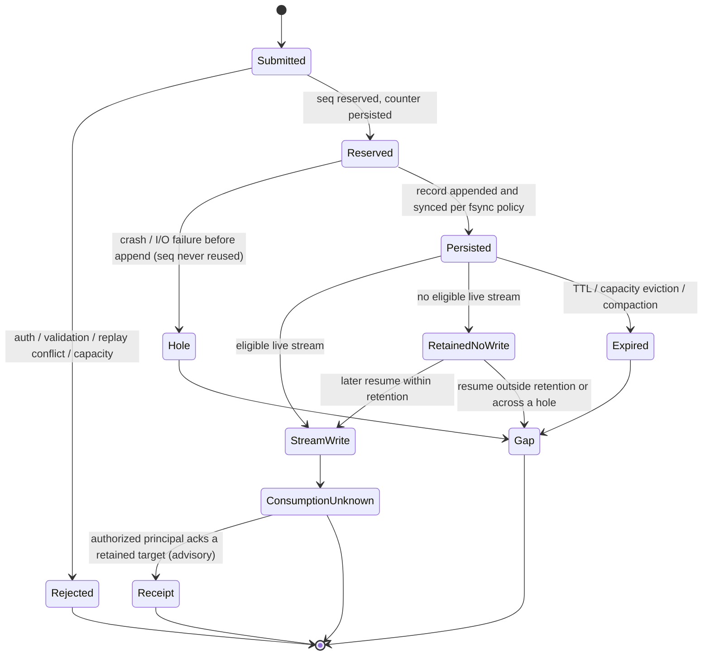

# Local durable delivery profile — xeip.local-durable/0.1 (design)

**Implementation status (first, dependency-free slice).** `services/relay/durable.mjs` implements a `DurableStore` over a caller-provided directory using only `node:fs`/`node:path`/`node:crypto`: a segmented append-only log of length-prefixed, SHA-256-checksummed records; an atomically written manifest (temp + fsync + rename) holding per-session `nextSeq` high-water marks; per-session persisted monotonic `append(session, message) -> seq`; `since`/`lookup`/`lookupAllById`/`limits`/`status`; bounded `retentionMs`, `maxEntriesPerSession`, `maxSessions` and `maxBytes`; crash-safe bounded compaction that rewrites live records into fresh segments and unlinks superseded ones (triggered when dead bytes exceed half of `maxBytes` or on `close`, and exposed as `compact()`), so evicted records no longer occupy disk and `maxBytes` is enforced for real; torn-tail recovery reported as `"recovered"`; and fail-closed interior corruption. `createRelay({ durable })` is wired as an alternative to the in-memory `delivery` option, routing sequence assignment, `seq` framing, resume and receipt lookups through whichever store is active, and health reports `durableProfile` plus limits and `state`. **Deferred/partial:** multi-process locking, durable receipt records, the SQLite backend and at-rest encryption. Empty sessions are reaped (the session map and manifest stay bounded while the high-water sequence is remembered in memory for gap reporting), and `fsync:"batch"` writes the manifest atomically per append but only fsyncs it on compaction/close, reconstructing `nextSeq` from records on recovery. The rest of this document is the design and is unchanged.

**Status: a first dependency-free slice is implemented; the rest is design.** This document specifies a bounded, restart-surviving delivery store for the [HTTP + SSE](transports/http-sse.md) and [WebSocket](transports/websocket.md) development transports, carrying unchanged XEIP `"0.1"` envelopes. It provides a persistent backing for the delivery semantics — selected instead of the in-memory `delivery` option — and composes with the [local replay](local-replay.md) and [local receipts](local-receipts.md) profiles. It is **not** an exactly-once system, not proof of processing, and not a production queue. [ADR 0006](decisions/0006-durable-delivery.md) records the decision and its deferral.

This profile exists to advance [issue 4](https://github.com/powerpuff-kitty/XEIP/issues/4) (offline/persistent delivery profile and stable reconnect cursors) and [issue 21](https://github.com/powerpuff-kitty/XEIP/issues/21) (bounded persistent queues, TTL, resume cursors, failure injection). Both remain **incomplete**: a first slice with tests exists (see the status note above), while compaction, multi-process locking, durable receipts, the SQLite backend, at-rest encryption and benchmarks remain design.

## Selection and limits

Enable explicitly through `createRelay({ token | admission, durable: { ... } })`, selected **instead of** the in-memory `delivery: { ... }` option. The durable store provides the delivery wire framing and cursor contract (`seq`, SSE `id:`, `Last-Event-ID`/`after`, `subscribe.after`); `durable` changes the **backing** from process memory to a persistent store. Specifying both `delivery` and `durable` is an error, as is `durable` with an unknown backend or a store directory that cannot be created. Null, unknown option keys, non-integers and out-of-range values are errors. Configuration is copied.

```
createRelay({
  token | admission,
  // Select durable INSTEAD of the in-memory delivery option:
  durable: {
    backend: "segments",       // recommended default; "sqlite" is the alternative
    dir: "/var/lib/xeip/store", // operator-provisioned, owner-only
    retentionMs: 3600000,      // TTL, 1–2592000000 (up to 30 days)
    maxEntriesPerSession: 4096,
    maxSessions: 1024,
    maxBytes: 268435456,       // total stored byte budget, 1 MiB–16 GiB
    fsync: "batch",            // "always" | "batch" | "never"
    lock: "exclusive"
  }
})
```

The durable store provides the same framing/cursor contract as the in-memory delivery profile and additionally enforces `retentionMs`, `maxEntriesPerSession`, `maxSessions` and `maxBytes`. `maxBytes` is the total-byte budget the in-memory profile explicitly lacks.

Health adds `durableProfile: "xeip.local-durable/0.1"` and `durable: { backend, retentionMs, maxEntriesPerSession, maxSessions, maxBytes, fsync, state }`, where `state` is `"ok"`, `"recovered"` (a torn tail was truncated and a gap will be reported) or `"degraded"` (interior corruption detected; see below). The existing `deliveryProfile`, `resumeProfile` and `receiptProfile` fields are unchanged. Health never exposes message bodies, principals or per-session cursors.

## Storage abstraction

The relay core talks to a `DurableStore` interface and remains **transport-neutral and backend-neutral**: no route, envelope or framing depends on which backend is selected.

```
DurableStore (design):
  open(config) -> { recovered, degraded }
  reserveSeq(session) -> seq                     // durable monotonic counter reservation
  append(entry)                                  // { session, seq, receivedAt, envelopeBytes }
  since(session, after, limit) -> { entries, gap, from, oldestRetainedSeq, newestSeq }
  lookup(session, seq) / lookupAllById(session, id)
  recordReceipt(principalDigest, sessionDigest, seq, idDigest, expiresAt)
  lookupReceipt(principalDigest, sessionDigest, seq)
  compact(now) / truncateTo(session, seq) / limits() / close()
```

Two concrete backends are proposed:

1. **Segmented append-only log (recommended default).** A store directory holds a small mutable manifest/checkpoint plus immutable append-only segment files, one length-prefixed, checksummed record per accepted envelope. The manifest records, per session, the persisted high-water mark (last assigned `seq`), the oldest retained `seq` and the last compaction generation. Appends are written to the active segment; the manifest is advanced after the records it covers are synced, honoring `fsync`. Compaction writes live records into a new segment, fsyncs it, then atomically swaps the manifest pointer (temp + `rename`) and unlinks superseded segments. This is dependency-free and matches the repository's current no-dependency relay.
2. **SQLite backend (alternative).** A single database file in WAL mode with a `deliveries(session, seq, received_at, message)` table keyed by `(session, seq)`, an index on `(session, id)` for `id`-only correlation, a `sessions(session, high_water, oldest_retained)` table and a `receipts(...)` table. Durability and crash recovery are delegated to SQLite. This requires a pinned dependency (or Node's experimental `node:sqlite`) and is offered where transactional simplicity outweighs the dependency-free constraint.

The stored value is the **verbatim XEIP envelope** so a resuming subscriber receives byte-identical framing to a live subscriber. No envelope field is added, removed or rewritten. This design does not choose a canonical/signing serialization; see [core.md](core.md).

## Per-session sequencer and restart

When durable mode is enabled, acceptance reserves a strictly increasing integer `seq` per session and persists the counter before the acceptance is reported as durable. The persisted high-water mark is the single source of truth for restart:

- On startup, `open()` reads the manifest/SQLite tables. `nextSeq(session)` is `highWater + 1`. A `seq` is **never reused**, even after eviction, compaction or a crash.
- If a record exists above a missing/corrupt counter, the counter is reconstructed as `maxRetainedSeq + 1` and `state` is reported `"recovered"`.
- If neither counter nor records exist for a session, sequencing starts at `1`. A client cursor below the first retained `seq` (for example a cursor carried over from a previous in-memory run) yields an explicit gap, never a silent skip.

Failure and rollback behavior is deliberately conservative:

- A `reserveSeq` that succeeds but whose `append` does not complete (crash, I/O error, timeout) leaves a **hole**: that `seq` is consumed and never reissued. A subscriber resuming across the hole receives `xeip.gap`. This is the honest cost of not writing a record and a counter in one atomic transaction.
- `fsync: "always"` fsyncs the record and counter before reporting durable acceptance, so a cleanly synced acceptance survives power loss. `fsync: "batch"` (the default) fsyncs on an interval and may lose the most recent unsynced tail on power loss; ordering still guarantees the counter never trails a synced record, so lost tail entries become holes, not reuse. `fsync: "never"` is for ephemeral tests only and cannot promise restart survival.
- A failed append MUST NOT decrement the counter. "Rollback" means the record is absent, not that the sequence is recycled. There is no automatic deletion of an already-announced `seq`.

## Retention, TTL, capacity, compaction and corruption

- **Retention/TTL.** Entries older than `retentionMs` are eligible for reclamation. Because process-monotonic time does not survive restart, durable retention uses the persisted wall-clock `receivedAt` compared against the relay's `Date.now()` at open and on maintenance, not the in-memory monotonic clock. This makes durable retention subject to wall-clock changes and NTP steps; clock rollback can extend retention and clock jumps can expire entries early. This limitation is intentional and recorded as an open question.
- **Capacity.** Four bounds apply: `retentionMs`, `maxEntriesPerSession`, `maxSessions` and total `maxBytes`. Byte accounting counts stored envelope bytes plus record/index overhead and is an operational budget, not an exact filesystem guarantee. A member can still monopolize a session's or the store's capacity until retention expires; this profile adds no per-principal fairness or rate limiting.
- **Eviction.** Within a session, the oldest entries are dropped first; across sessions, least-recently-used sessions are dropped, using persisted last-access times where available and falling back to `receivedAt` after a restart (an approximation). Evicting a session records its last assigned `seq` so a later message continues the same monotonic sequence and a stale cursor yields a gap.
- **Compaction.** Triggered by byte/entry thresholds or on open. It rewrites only live records (unexpired, unevicted) into a new generation and atomically swaps the manifest. A crash during compaction leaves the previous generation valid; the abandoned generation is reclaimed on the next open. Compaction never changes a retained `seq` and never resets a counter.
- **Corruption.** Every record carries a length prefix and checksum. A truncated or checksum-failing **tail** is discarded up to the last valid record, `state` becomes `"recovered"`, and `since` reports a gap for the discarded sequences. Interior corruption (a bad record that is not the tail, or an unreadable manifest) is **fail-closed by default**: `open()` refuses to serve the store rather than silently reinterpret bytes. An explicit operator salvage mode may truncate from the first corrupt record onward and start a new generation, always reporting `"degraded"` and a gap. This profile never performs lossy byte-level repair and never fabricates a record.

## Cursor and offset semantics across restart

The cursor contract is exactly the [local delivery](local-delivery.md) contract: a per-session non-negative integer `seq` supplied as HTTP/SSE `Last-Event-ID` or `after`, or WebSocket `subscribe.after`, selecting retained entries with `seq` strictly greater than the cursor. Cursors remain per `(store instance, session)`; there is no cross-relay cursor.

**What remains valid across restart (designed):**

- The per-session `seq` mapping, provided the counter for that session was persisted by the same store. A client cursor is thus expected to survive a relay restart.
- Retained envelopes still inside `retentionMs`, `maxEntriesPerSession`, `maxSessions` and `maxBytes`.
- A cursor exactly at the newest retained `seq` yields nothing, as today.

**What does not remain valid across restart (designed):**

- Cursors produced by the in-memory `xeip.local-delivery/0.1` profile: no store existed, so nothing persists and a new process starts at `1`.
- Entries past retention, evicted sessions and sequences consumed as holes: a resume below the oldest retained `seq` yields `xeip.gap`/`{ "type": "gap", "from": <oldestRetainedSeq> }`, never a silent skip.
- Any cursor from a different store directory, a different backend, a different manifest generation with an incompatible version, or a store whose counter reconstruction chose a different epoch.
- In-memory `windowMs` monotonic expiries: they are not transferred to disk; durable retention is a separate wall-clock policy.

A cursor is a hint about where to resume, not a promise that the gap between cursor and backlog was delivered; the relay reports a gap rather than implying continuity.

## Delivery guarantee, idempotency and deduplication

The guarantee is deliberately narrow and honest:

- **At-least-once delivery of retained backlog to a resuming subscriber**, subject to retention, capacity, compaction and corruption recovery. An accepted-and-synced entry can be re-delivered if a subscriber resumes from an earlier cursor or disconnects after a queued write.
- **Never exactly-once.** The relay cannot observe consumption or prevent duplicate application effects. A resume can legitimately re-deliver; a receipt is advisory. Any "exactly-once" claim is forbidden by [core.md](core.md) and [ROADMAP.md](../ROADMAP.md).
- **No automatic durable deduplication of accepted IDs.** The existing [local replay](local-replay.md) ledger remains the only dedup mechanism: an in-memory, digest-only, fixed-window suppression of identical `(session, authenticated sender, id)` acceptances. Durable mode does not extend the replay window and does not persist replay digests. A durable dedup index is a possible future extension and is recorded as an open question; if added it still could not promise exactly-once effects.
- **Application idempotency is the application's responsibility.** Consumers SHOULD deduplicate on envelope `id` (and application-level idempotency keys) and treat a re-delivered envelope as a possible duplicate. This mirrors the [RFC 9110 §9.2.2](https://www.rfc-editor.org/rfc/rfc9110.html#name-idempotent-methods) caution the replay profile cites.
- Ordering remains per-session **acceptance order** on one store, which implies per-sender order for one sender. It is not sender creation order, cross-relay order or application completion order.

## Durable receipt correlation

When `durable.receipts` is selected (requiring [admission](local-admission.md), `delivery` and `durable`, exactly as [local receipts](local-receipts.md) requires admission and delivery), a receipt is correlated against the durable delivery log and its record is persisted:

- The receipt key stays `(principalDigest, sessionDigest, seq)`, with `idDigest` and a monotonic expiry. Correlation against the durable log survives restart, so an authorized principal can record a receipt for an acceptance that is still retained **after** a relay restart, and an idempotent repeat still reports `duplicate: true`.
- What still does **not** change: a receipt means only that an authenticated, currently authorized principal asserted it holds a retained acceptance. It is not proof of processing, not proof of a prior write, not exactly-once and never broadcast to another principal. Application completion remains outside the protocol.
- What is newly durable: the assertion and its correlation source. What remains bounded: a receipt for a target later evicted, expired or corrupted is no longer correlatable and fails as not retained; receipt retention is bounded by the same capacity/`retentionMs` policy and by a receipt-specific cap. Receipts are owner-only, never returned across principals.
- Revocation and membership are re-evaluated at receipt time using current admission state; durable receipts do not preserve authorization. Persisting a receipt does not persist a credential or grant.

## Multi-process, concurrency, locking, permissions and at-rest confidentiality

- **Single writer.** One relay process owns a store directory. `lock: "exclusive"` takes an OS advisory lock (for example `flock`) on a lock file at open. A second process either fails closed or, if an explicit `lock: "shared-readonly"` is selected, serves only reads with sequencing disabled. Concurrent multi-writer operation, replication and clustering are not provided by 0.1.
- **Atomicity.** Segment writes use append + sync; manifest and compaction swaps use temp files, `fsync` and atomic `rename`, plus a directory `fsync`. SQLite uses its WAL. Torn tails are the only tolerated partial state.
- **Permissions.** The store directory is created owner-only (`0700`) and files `0600`, subject to the process umask. A store readable by group or other is refused at open unless an explicit operator override is set. Only the relay owner may read, back up or delete the store.
- **At-rest confidentiality.** This is the honest weak point. The store retains **plaintext XEIP envelopes and plaintext-adjacent correlation metadata** for the whole retention period, exactly as the in-memory log does today, but now on disk. There is **no E2EE and no per-record encryption** in 0.1; at-rest confidentiality depends entirely on host/filesystem permissions, full-disk encryption, backup hygiene and physical trust of the relay workstation. Disk images, snapshots, backups and swap may retain envelope plaintext. Credentials are never written to the store, and health/logs never expose bodies, principals or message IDs. This extends [threat-model.md](threat-model.md) T7 (token/plaintext exposure through files) and is a residual risk, not a control. A pluggable encryption layer with key management is deferred.

## Delivery state diagram (design)



Relay acceptance, transport write, recipient receipt and application completion remain separate states. A `receipt` kind or `replyTo` is still unverified application data. A disconnect after a queued write can still lose the delivery until a resume re-sends it, and a receipt does not cancel re-delivery.

## Migration and rollback

- **In-memory → durable.** Adding `durable` (with `delivery`) keeps the wire framing identical and switches the backing to a persistent store. The first durable start creates an empty store and begins at `seq` `1` per session; prior in-memory sequences and backlogs are **not** imported because they were never persisted. A client holding a cursor from the in-memory epoch MUST treat it as untrusted: a cursor below the new oldest retained `seq` yields a gap, and the client should fall back to a fresh subscription.
- **Durable → in-memory.** Removing `durable` returns to the in-memory [delivery](local-delivery.md) profile. The store directory is ignored and left in place; the operator may delete it. No automatic export from disk back into memory is provided, and no envelope schema changes.
- **Versioning.** The manifest carries a store-format version. An unknown or newer version causes `open()` to refuse rather than guess. A future migration tool may convert generations, but no migration is implemented.
- **Rollback from validation errors is not automatic.** A rejected request never reserves or appends; a reserved-but-unappended `seq` is a permanent hole, not a rollback.

## Explicit non-goals

- Exactly-once execution, proof of processing, or any guarantee of command side effects.
- Durable deduplication that prevents duplicate application effects; only the bounded in-memory replay ledger exists.
- Cross-relay, cluster, federated or global ordering; replication or multi-writer coordination.
- E2EE, per-record encryption, key management or at-rest confidentiality beyond host controls.
- Infinite or indefinite retention; guaranteed delivery after retention, capacity or corruption loss.
- Sender-visible or attributed receipts, or receipts that change retention/re-delivery.
- Production identity, multi-tenant isolation, independent security review or hosted hardening.
- Any benchmark, throughput or failure-injection result: none has been measured. Issue 21's measurement criterion is unmet.

## Open questions

1. Default backend: the dependency-free segmented log or SQLite's transactional simplicity?
2. Retention clock: accept wall-clock rollback/jump semantics, or define a persisted logical clock plus skew bounds?
3. `fsync` default: `always` for stable cursors at a latency cost, or `batch` accepting documented power-loss holes?
4. Should accepted-ID deduplication become durable, and if so how is it kept separate from any exactly-once implication?
5. Multi-process: fail-closed second writer, shared-readonly reader, or a future single-writer broker?
6. Are receipt records bounded strictly by the delivery entry's retention, or may a receipt outlive its target?
7. At-rest encryption: leave it to OS/full-disk encryption, or add a pluggable encrypted store with a key-management design?
8. How should compaction and corruption salvage interact with stable cursors and gap reporting?
9. Does `maxBytes` include index/manifest/compaction overhead, and how is that measured across generations?
10. Should a session URI that is deleted and later reused continue or reset its `seq` to avoid confusing a returning client?

## Mapping to issues #4 and #21

[Issue 4](https://github.com/powerpuff-kitty/XEIP/issues/4) asks to distinguish the four delivery states, define correlation/backoff/expiry/dedup/ordering, define stable reconnect cursors and an offline/persistent profile, and never falsely claim exactly-once.

- **Delivery state machine with diagrams** — [the durable state diagram](#delivery-state-diagram-design), extending the existing [delivery](local-delivery.md) and [receipt](local-receipts.md) diagrams with reservation, holes, persistence and expiry.
- **Stable reconnect cursors** — designed: `seq` and the backlog survive restart within retention via the persisted counter and store; a cursor outside retention or across a hole yields an explicit gap.
- **Offline/persistent delivery profile** — this document is the design; **not implemented**.
- **Correlation IDs / retry backoff / expiry / deduplication** — carried over from the existing profiles: envelope `id`/`replyTo`, the replay suppression window, transport expiry and receipt idempotency. Backoff remains client policy; durable mode adds no SDK retry.
- **Per-sender ordering scope** — per-session acceptance order on one store; explicitly not creation or completion order.
- **Exactly-once not falsely claimed** — the [guarantee](#delivery-guarantee-idempotency-and-deduplication) and [non-goals](#explicit-non-goals) state at-least-once and forbid exactly-once.
- **Conformance tests for disconnect/retry/duplicate/reordered frames** — **not written**. The intended suite is listed below; it does not exist.

[Issue 21](https://github.com/powerpuff-kitty/XEIP/issues/21) asks for bounded persistent queues with retention and TTL, backpressure/dedup/resume cursors, and throughput/memory measurements under slow or intermittent consumers.

- **Bounded persistent queue with retention and TTL** — designed (`retentionMs`, `maxEntriesPerSession`, `maxSessions`, `maxBytes`); **not implemented**.
- **Backpressure** — the existing per-stream outbound queue bound and disconnect policy apply; durable mode adds an on-disk capacity bound but no new per-principal fairness.
- **De-duplication** — unchanged: advisory, in-memory replay ledger only; durable dedup is an open question.
- **Resume cursors for dropped connections** — designed to survive restart within retention.
- **Offline delivery recovers within the retention budget** — designed; unverified.
- **Duplicates handled per published semantics** — at-least-once plus application idempotency; unverified.
- **Benchmarks and failure-injection scenarios documented** — **not met**. Intended scenarios: restart mid-append, torn tail, interior corruption, manifest swap during compaction, wall-clock rollback, slow consumer with a full stream queue, intermittent reconnect with cursors at the retention edge, and `maxBytes` pressure. None has been run.

Both issues remain open. This is a proposal only; implementing it requires code, conformance tests, failure-injection evidence and a security review of the at-rest and multi-process boundaries.
