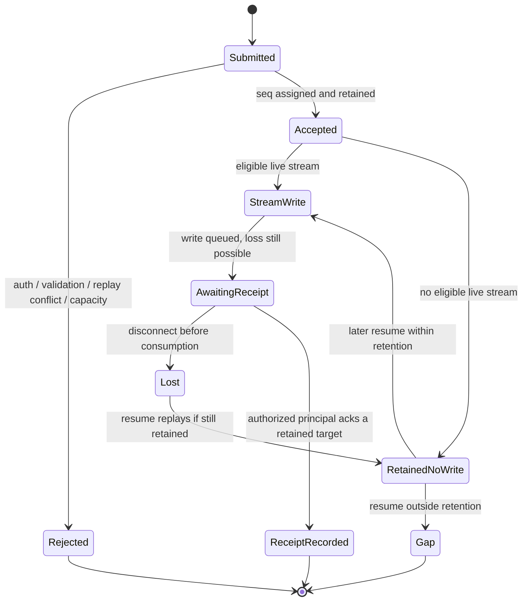

# Local delivery receipts profile — xeip.local-receipts/0.1

Experimental, opt-in recipient-acknowledgment extension for the [HTTP + SSE](transports/http-sse.md) and [WebSocket](transports/websocket.md) development transports, carrying unchanged XEIP `"0.1"` envelopes. It lets an authenticated subscriber acknowledge a specific retained delivery, correlates that acknowledgment against the [local delivery](local-delivery.md) log, and remembers it in a **bounded, per-principal ledger** — in memory by default, or persisted inside the [durable](local-durable.md) store directory when both `receipts` and `durable` are configured. It is not exactly-once execution, not proof of processing and not a replacement for the application-level `receipt` kind. It is implemented as an opt-in local prototype in `services/relay/receipts.mjs`; [ADR 0005](decisions/0005-local-receipts.md) records the decision.

> **Status note (durable slice).** `createRelay({ admission, durable, receipts })` now persists the ledger to `<durable.dir>/receipts.log` and reloads unexpired records on construction, so an idempotent repeat reports `duplicate: true` after a restart. Each line is digest-only (principal digest, session digest, ID digest, `seq`, wall expiry); no envelope copy is written and no endpoint or health field exposes per-principal receipt state. A torn tail is dropped (`durable.state: "recovered"`); interior corruption fails closed to "no receipts" and reports `durable.state: "degraded"`. Without `durable`, the ledger is unchanged and still memory-only. Online compaction of a long-running receipt log is deferred (the log is rebased on each startup).

## Selection and limits

Enable explicitly with `createRelay({ admission, delivery: { ... }, receipts: { windowMs: 300000, maxPerSession: 512, maxPerPrincipal: 4096 } })`. `receipts: {}` uses those defaults. Receipts require both the [local admission](local-admission.md) profile and the [local delivery](local-delivery.md) profile: admission supplies a trustworthy authenticated principal and recipient rules, and delivery supplies the retained acceptance log that a receipt is correlated against. Receipts without admission, without delivery, or alongside a shared token are errors, because a shared token cannot bind the acknowledging principal to an intended recipient. Null, unknown option keys, non-integers and out-of-range values are errors. `windowMs` is 1–3600000 milliseconds, `maxPerSession` is 1–4096 receipts per `(session, principal)` pair, and `maxPerPrincipal` is 1–8192 receipts per authenticated principal. Configuration is copied. Receipts can be combined with replay and delivery.

Health adds `receiptProfile: "xeip.local-receipts/0.1"` and `receipts: { windowMs, maxPerSession, maxPerPrincipal }`. The existing `deliveryProfile` and `resumeProfile` fields continue to describe the replay ledger and the delivery log. Health never exposes per-principal receipt state or counts.

## The four delivery states

The profile keeps four states distinct and only implements acknowledgment of the third:

1. **Relay acceptance.** The authenticated, validated, unexpired envelope was accepted, assigned a per-session `seq` by the delivery profile and retained. HTTP 202 and the acceptance body report this state only; `accepted` is not a receipt.
2. **Transport write.** The relay queued the serialized frame to one or more currently eligible streams and counted each as `delivered`. A queued write can still be lost if that stream disconnects before the client consumes it.
3. **Recipient receipt.** A currently authorized authenticated principal asserts, through this profile, that it holds a specific retained acceptance identified by `seq` and/or message `id`. The relay correlates and privately remembers the assertion within its bounded window.
4. **Application completion.** The recipient application has actually processed, executed or acted on the content. This profile does **not** implement, verify or infer this state. An application may still send an ordinary `kind: "receipt"` envelope or use `replyTo`, but that remains unverified application data/correlation exactly as in [core.md](core.md); the relay does not look it up.

## Acknowledging and correlating a receipt

A receipt is a transport control document, not a XEIP envelope. It MUST name the `session` and at least one of `seq` (non-negative, no leading zeros) or `id`; an optional `status` defaults to `"received"` and this version defines only that value. Unknown fields are rejected.

The relay processes a receipt in this order:

1. Authenticate the credential and resolve the current authenticated principal (admission). A revoked or unknown credential fails before any correlation.
2. Validate the control shape, field types, selector syntax and request bounds; require the receipts profile to be enabled.
3. Require the `session` to be authorized for that principal.
4. Resolve the target against the retained delivery log for that session. With `seq`, look up that entry; with both, the entry's `id` MUST equal the supplied `id` or the receipt is rejected. With `id` only, match retained entries by ID digest; zero matches is not retained, and more than one match is ambiguous and rejected.
5. Verify the principal is an eligible recipient of that retained envelope under the same membership and recipient rules as live routing: an explicit `recipient` MUST equal the principal, and an omitted recipient admits a current authorized session member. This is an eligibility check, not proof that a write occurred.
6. Record or refresh one receipt for the `(principal, session, seq)` key with a fresh monotonic expiry set to `now + windowMs`. A duplicate slides the window rather than adding a record, so repeated acknowledgment keeps that receipt alive; the receipt ledger is independent of the delivery log and may outlive an evicted target. A full bound never fails the request.
7. Return the acknowledgment to the acknowledging connection only. The relay does not broadcast a receipt, does not attribute it to another principal, and does not change `delivered`, the stored envelope, the delivery sequence, resume behavior or retention.

A receipt can be recorded even when the principal was offline at the original acceptance, because resume made the message available within retention. It therefore means "this authorized principal now asserts it holds this retained acceptance", not "the relay wrote these bytes to this principal".

## What a receipt does and does not mean

A recorded receipt means an authenticated, currently authorized principal asserted it held a specific retained acceptance, and the relay correlated and remembered that assertion within a fixed bounded window.

It does **not** mean, and MUST NOT be presented as:

- exactly-once execution, or that an action happened at most once;
- proof of processing, execution, interpretation or human/agent review;
- proof that the relay wrote the message to that principal, or that the principal did not later lose it;
- durability: without the [durable](local-durable.md) backing it is memory-only, expires on its window, is evicted under bounds and is lost on process restart or a new factory; with `durable` enabled the assertion and its wall-clock expiry survive restart but correlation still fails once the target is no longer retained;
- authentication of a `kind: "receipt"` envelope or of `replyTo`, which remain unverified application data;
- authorization for any command or side effect;
- an ordering proof: receipt order is not acceptance order, sender creation order or application completion order;
- sender-visible evidence: no other principal learns of it through this profile;
- a replay or deduplication defense, which the optional [local replay](local-replay.md) profile provides separately and only within its own window.

## Delivery and receipt state diagram

Application completion is intentionally absent: it has no protocol transition here. A lost write is recoverable only while the acceptance is still retained, and a receipt is recorded only while the target is still retained.

## Transport framing

### HTTP + SSE

- `POST /receipts` with `Authorization: Bearer <credential>` and exactly `application/json`, body `{ "session": "<session-URI>", "seq": 42, "id": "urn:xeip:message:...", "status": "received" }`.
- Success is HTTP 202 `{ acknowledged: true, session: "...", seq: 42, duplicate: false }`. `duplicate: true` means an identical receipt was already remembered; the response then carries no new record.
- Request bodies are limited to 64 KiB. The receipt response is a small fixed JSON document and does not carry the envelope or another principal's data.
- The SSE stream is unchanged: `event: xeip.message` frames and `id: <seq>` framing as in the [delivery profile](local-delivery.md). No receipt is ever written to any stream, including the acknowledging principal's, to avoid cross-principal disclosure.

### WebSocket

- Client → server: `{ "type": "receipt", "session": "...", "seq": 42, "id": "...", "status": "received" }` — at least one of `seq`/`id` required. An unknown `type` or invalid document yields `400`.
- Server → client: `{ "type": "acknowledged", "session": "...", "seq": 42, "duplicate": false }` — delivered only on the acknowledging connection.
- Errors reuse `{ "type": "error", "status": <HTTP-like code>, "error": "<diagnostic>" }`; the diagnostic is not a stable typed code.
- Existing framing, mask, UTF-8, close-code and 256 KiB outbound queue limits apply unchanged. A receipt does not change the `message` or `gap` controls.

## Errors and resource bounds

Receipt processing reuses the existing loopback authority/origin gates and admission authentication. Errors are generic and MUST NOT reveal message existence beyond the necessary status, another principal's receipts, the sender, or membership:

| Status | Condition |
| --- | --- |
| 400 | Malformed control document, missing selector, unknown field, invalid `status`, or a receipt sent when the receipts profile is not enabled |
| 401 | Missing, incorrect or revoked credential |
| 403 | Authenticated principal is not an eligible recipient of the target, or its session authorization fails |
| 404 | The target `seq`/`id` is unknown or is no longer retained |
| 409 | Supplied `seq` and `id` disagree, or an `id`-only receipt matches more than one retained acceptance |
| 413 | Request or receipt body exceeds the transport byte bound |
| 415 | Receipt media type is not `application/json` |

The receipt ledger is bounded three ways: by `windowMs` on a process-monotonic clock, by `maxPerSession` per `(session, principal)` pair, and by `maxPerPrincipal` per authenticated principal. Records are fixed-size: the authenticated principal digest, session digest, ID digest (Node SHA-256, as in the [replay ledger](decisions/0002-local-replay-window.md)), `seq`, and expiry. The ledger does not retain a second copy of the envelope; the [delivery log](local-delivery.md) already retains the full envelope, so a receipt adds no new plaintext retention. On overflow the relay evicts the oldest receipt within the exceeded bound, because a receipt is advisory and explicitly non-durable; a receipt request is never failed merely because a bound is full. Without `durable`, restart, eviction or window expiry forgets receipts; with `durable`, unexpired records reload from a digest-only log and the same bounds are rebuilt by evicting the oldest loaded receipt. Entry counts are not exact heap limits.

## Non-disclosure and authorization

- The ledger is keyed by the authenticated principal. No endpoint or control returns another principal's receipts, and health exposes only the profile name and limits.
- Receipt eligibility is re-evaluated at receipt time with the same admission rules as routing. A principal that loses membership or whose credential is revoked cannot record a new receipt.
- A receipt does not grant authority and does not itself advance any command or side effect.
- The relay records the assertion, not the bytes, and does not echo it to the sender in this profile.

## Migration and rollback

Adding the `receipts` option is additive and explicit. Without it, `POST /receipts` and the WebSocket `receipt` control both return `400` (profile not enabled), health omits the receipt fields, and all existing modes, schemas and fixtures behave as before. Selecting it requires admission and delivery/durable, so a shared-token or delivery-only deployment is never silently upgraded. Removing the option restores the prior behavior and drops the in-memory ledger; when `durable` was configured it also leaves the digest-only `<dir>/receipts.log` in place for the operator to delete, and no envelope data, credential or schema is persisted. Rollback is not automatic after a validation or authorization error.

## Explicit non-goals

- Cross-relay receipts and correlation; local `durable` persistence is now implemented, but there is still no multi-relay or global receipt store, and online compaction of the receipt log is deferred.
- Proof of processing, execution or human/agent review; a `completed` status is not defined in 0.1.
- Exactly-once execution or any command side-effect guarantee.
- Sender-visible, attributed or aggregated receipt reporting; see open questions.
- Receipt-driven resume suppression, re-delivery cancellation or read receipts changing retention.
- Acknowledging messages that are not in the retained delivery log, or receipts for other profiles' messages.
- Per-principal request quotas, fairness or rate limiting beyond the ledger bounds.
- E2EE, production identity, multi-tenant isolation or independent security review.

## Open questions

1. Should a sender or a withheld party ever observe a receipt, and if so as an anonymous aggregate, a per-message count, or an opt-in attributed acknowledgment? The current design discloses none.
2. Should an acknowledged `seq` suppress resume re-delivery for that principal (ack-based resume), or stay purely informational?
3. Should overflow evict the oldest advisory receipt (proposed) or refuse with `503`/`Retry-After` as the replay ledger does? The two profiles currently differ.
4. Is a verified or at least explicitly-labelled application-completion (`status: "completed"`) worth defining, given the relay can never verify it?
5. Must a `completed` claim for a target be preceded by a `received` claim, and does a later status replace or accompany the earlier one?
6. Should `id`-only correlation be allowed at all, or should `seq` always be required to avoid ambiguity when the same ID was accepted more than once?
7. What is the smallest durable/persistent receipt profile that could later support offline senders and cross-relay correlation without a central store?

## Mapping to issue #4

[Issue 4](https://github.com/powerpuff-kitty/XEIP/issues/4) asks to distinguish the four states, define correlation/backoff/expiry/dedup/ordering, define stable reconnect cursors and an offline/persistent profile, and not to falsely claim exactly-once.

- **Delivery state machine with diagrams** — [the four states](#the-four-delivery-states) and the [mermaid diagram](#delivery-and-receipt-state-diagram).
- **Correlation IDs** — existing envelope `id`, `replyTo` and the delivery `seq`; this profile correlates an acknowledgment by `seq`/`id` against the retained log.
- **Retry backoff, expiry and deduplication** — reuses the [replay](local-replay.md) suppression window and the transport expiry check; the receipt ledger adds its own idempotent `(principal, session, seq)` record and monotonic expiry. Backoff remains client policy (the relay returns `Retry-After` only for the replay ledger).
- **Per-sender ordering scopes** — acceptance order per session from the [delivery profile](local-delivery.md), explicitly not sender creation or completion order.
- **Stable reconnect cursors** — `Last-Event-ID`/`after`/`subscribe.after` from the delivery profile; receipts do not change cursor stability.
- **Offline/persistent delivery profile** — **not met**: receipts and deliveries are in-memory and restart-loses. The design records this as [open question](#open-questions) 7 and a non-goal.
- **Conformance tests for disconnect/retry/duplicate/reordered frames** — implemented for the local prototype: ack a retained target, duplicate ack, `seq`/`id` disagreement (409), ambiguous `id` (409), unknown/evicted target (404), ineligible recipient (403), acknowledgement without admission/delivery (construction error), revoked credential, and receipt-disabled regression. See `services/relay/receipts.test.mjs` and `services/relay/receipts-http.test.mjs`.
- **Exactly-once not falsely claimed** — the explicit [non-claims](#what-a-receipt-does-and-does-not-mean) and [non-goals](#explicit-non-goals).

Issue 4 remains incomplete: durable/idempotent delivery, offline recovery and a persistent/cross-relay receipt profile are still required.
