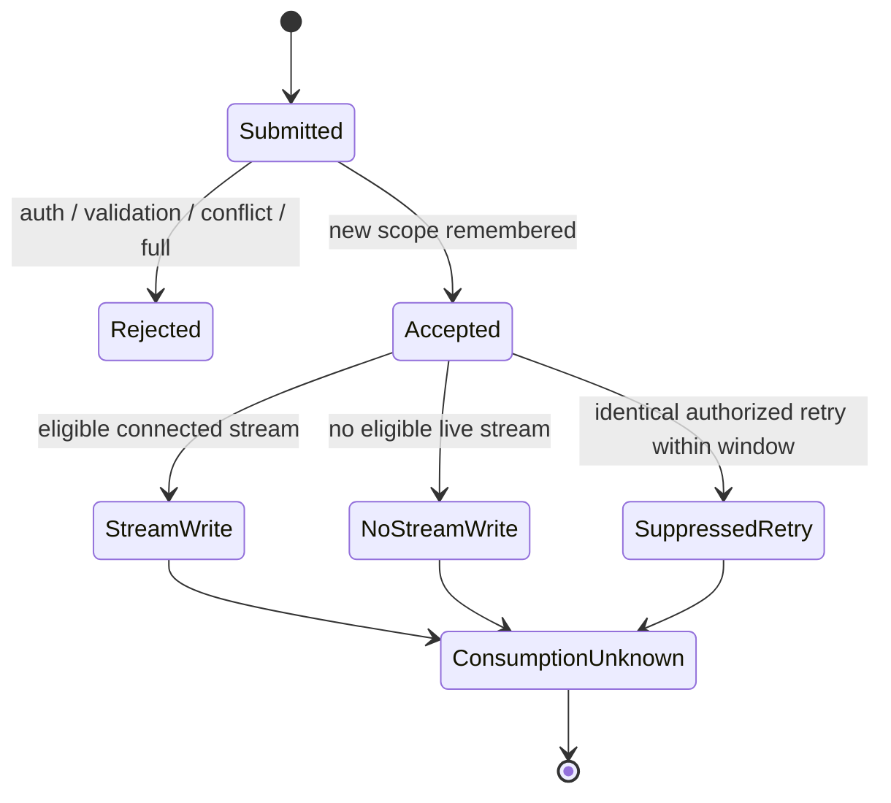

# Local replay profile — xeip.local-replay/0.1

Experimental delivery extension for [local admission](local-admission.md), carrying unchanged XEIP `"0.1"` envelopes. [ADR 0002](decisions/0002-local-replay-window.md) records the bounded in-memory scope. It suppresses repeat relay writes within a window; it is not recipient delivery, durable replay protection or exactly-once execution.

## Selection and limits

Enable explicitly through `createRelay({ admission, replay: { windowMs: 300000, maxEntries: 4096 } })`. `replay: {}` uses those defaults. Replay without a `LocalAdmission` policy is an error; null, unknown option keys, non-integers and out-of-range values are errors. `windowMs` is 1–3600000 milliseconds; `maxEntries` is 1–4096. The factory copies configuration values, and later caller changes cannot alter the window. The CLI and admission-only mode retain their original forwarding behavior.

Run `npm run demo:replay` for a self-contained simulated exchange with retry suppression, conflicting-content rejection, an authorized stream disconnect/reconnect and active credential revocation. It generates temporary credentials without printing them and cleans up its relay/streams.

Health adds `deliveryProfile: "xeip.local-replay/0.1"` and `replay: { windowMs, maxEntries }` to the existing admission health response. These are public limits, not a credential/member list. The ledger retains at most the configured number of records, each containing fixed-size scope/content digests and an expiry time. The ledger does not retain envelopes or plaintext message IDs. Digests remain operational metadata, not anonymization. Entry bounds are not a precise JavaScript heap-size guarantee; transient parsing/framing is bounded by the existing transport limits.

## Scope and equality

The scope is the exact session URI, authenticated entity URI and message ID URI. Different senders or sessions can use the same ID independently. There is no URI normalization. Credential generation is deliberately excluded: rotating a token must not let the same entity repeat an accepted message. All existing authentication, sender/recipient membership, expiry, JSON and outbound frame checks run before replay lookup.

Equality covers the complete parsed envelope. The relay recursively sorts object keys and JSON-encodes keys/primitives, preserving array order. It hashes that representation and the JSON-encoded scope tuple using SHA-256. Thus HTTP JSON whitespace and object-property order do not create new messages, but changed timestamps, recipients, kind, body, array order or extensions conflict. It compares parsed JavaScript JSON values: number rounding, `-0` becoming `0`, duplicate object names and lone-surrogate differences retain the limitations in [core.md](core.md). This is not cross-language canonical signing serialization, message integrity or an authentication mechanism.

## Acceptance and retry behavior

| Result after authorization/validation | HTTP response | New SSE writes |
| --- | --- | --- |
| First scope/content acceptance with available capacity | 202 `{ accepted: true, delivered: n, duplicate: false }` | Current eligible streams only |
| Same scope and content within its window | 202 `{ accepted: true, delivered: 0, duplicate: true }` | None |
| Same scope with changed content within its window | 409 `{ error: "message ID conflict" }` | None |
| New scope while every slot is occupied | 503 `{ error: "replay window full" }`, `Retry-After` whole seconds | None |

The replay window starts at the first accepted POST using process-monotonic elapsed milliseconds; it expires at elapsed time greater than or equal to acceptance plus `windowMs`. A duplicate/conflict does not renew it. Expired entries are reclaimed on a later authorized acceptance attempt. Live entries are never evicted to admit new messages. Retry-After rounds up to the earliest expiry and is advisory; other senders can take the released slot. A full ledger still recognizes existing duplicates/conflicts.

Recording and synchronous routing have no asynchronous gap between them, so simultaneous POSTs for the same scope cannot both perform first-acceptance writes within the same active replay window. Requests processed after a window expires can legitimately be accepted again, even if they were initiated concurrently. A write count is per request, not the first request's count copied into a retry response. An acceptance with zero subscribers is remembered as well. If the HTTP response is lost, the sender may explicitly retry the **same envelope** during the current relay instance's window. Rebuilding it with a fresh timestamp or changed data conflicts. A new ID is a new logical message and can be forwarded.

The SDK preserves and validates the optional `duplicate` boolean; `duplicate: true` requires zero writes. It does not automatically retry POSTs or reconnect/resume SSE. Authorization can change between attempts: revocation returns 401 and loss of membership returns 403, including for already accepted IDs. No duplicate response discloses another principal's ledger scope.

## Delivery states and ordering

Relay acceptance, transport write, recipient receipt and application completion are separate states. The last two have no automatic protocol implementation here. A `receipt` kind or `replyTo` only carries application data/correlation. A disconnect after a queued stream write can lose the message. No ACK, pending-delivery queue, cursor, ordering sequence, offline persistence or replay on reconnect is provided. Synchronous writes follow the relay's POST processing order, which does not guarantee sender creation order or application completion order; clients must not infer those from timestamps.

## Lifecycle and remaining work

Credential rotation, membership removal/re-addition and closing/re-listening the same native server preserve ledger records until their fixed expiry. Creating a new relay process/factory loses them. After expiry/restart, the same ID may be accepted again subject to ordinary authorization and envelope expiry. Clients cannot treat a health profile label as proof that an earlier ledger survived. Use short-lived synthetic messages and a trusted local deployment.

Durable identity/revocation, grants, request-rate quotas, durable deduplication, recipient acknowledgments, bounded offline queues, reconnect cursors and independent security review remain future work. A member can fill the shared ledger and temporarily deny new admissions; its entry cap bounds storage but is not fair scheduling or rate limiting. Suppression cannot prevent a command from executing twice outside this relay/window or under a new ID.

HTTP references: [RFC 9110 §9.2.2](https://www.rfc-editor.org/rfc/rfc9110.html#name-idempotent-methods) cautions against automatic retries without known idempotent semantics; [§15.3.3](https://www.rfc-editor.org/rfc/rfc9110.html#name-202-accepted) distinguishes HTTP acceptance from completed processing. The limited profile does not change the general semantics of POST.
