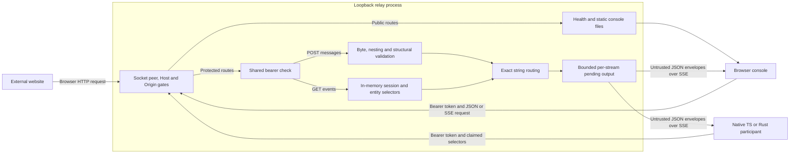

# XEIP 0.1 local relay threat model

Reviewed scope: the current in-repository loopback HTTP/SSE and WebSocket relay, browser console, TypeScript client, Rust HTTP peer and WebSocket client example, and data models, on 2026-10-09. This is an implementation-backed threat model and internal review, not an external penetration test or production security approval. [security.md](security.md) remains the production requirements document.

## Scope, assumptions and assets

The examples run on a single trusted workstation; the host OS, provisioner, browser runtime and installed dependencies are trusted. In shared-token CLI mode, every token holder is mutually trusted. The optional [local admission profile](local-admission.md) gives individual entities separate bearer credentials and owner-provisioned memberships, so holding one credential does not authorize impersonation or another session. The relay CLI binds only to `127.0.0.1` or `::1`, and the request handler rejects non-loopback socket peers even when embedded incorrectly. A reverse proxy, remote tunnel or hostile workstation invalidates both deployment assumptions. Token syntax/length checks do not prove randomness; operators must generate fresh unpredictable credentials and keep them off URLs and logs.

Assets are bearer credentials, admission configuration, plaintext message/descriptor contents, routing and correlation metadata, availability of the workstation/relay/clients, and integrity of repository fixtures/build artifacts. No actual model execution, camera access, command execution, persistent message store or entity signing keys exist in this scope. Production admission, encryption, signed discovery, delegation and federation are future designs, not controls to assume here.

Actors are the trusted admission owner, console user, Node/TypeScript/Rust participants, an external website, an unauthenticated local client, a compromised or malicious credential holder, and a dependency/build attacker. The external website and local clients are considered separately: browser Origin rules constrain the former, while native processes can forge HTTP headers.

## Data flows and trust boundaries

The diagram shows the shared-token mode. The machine/network boundary, browser-origin boundary, credential boundary, JSON parser boundary, and recipient-consumer boundary are distinct. Passing shared-token authentication does not bind the claimed sender or selectors. In admission mode, the credential boundary instead authenticates an immutable current entity record; both subscription selectors and POST sender/session/recipient are checked against private owner-provisioned policy. A POST rechecks authorization after reading its body, and routing only writes to currently authorized streams. Owner rotation, revocation and membership replacement invalidate and close affected streams. The policy has no HTTP administration route. Parsed JSON remains untrusted application input in both modes; structural validation, a capability label or a command kind does not grant execution authority.

The optional local replay extension inserts a private digest ledger after authorization, expiry and outbound-frame checks, before stream writes. Its exact scope contains the authenticated sender, session and message ID. Parsed content equality ignores object-property order but changes to other values conflict. Records are made synchronously before routing; they contain scope/content digests and monotonic expiry, not envelopes. Authorization is repeated on every retry and cannot be replaced by an earlier acceptance. The ledger survives native server relisten/credential rotation but not a new factory/process.

The relay does not resolve entity IDs or connect to advertised endpoints. The SDK base URL is supplied by its caller, and the Rust example fixes its destination to loopback, disables proxies and redirects, and uses a finite request timeout. Discovery/endpoint fetching would introduce a new SSRF and credential-disclosure boundary and must receive a separate review.

## Threats, controls and residual risk

Ratings use qualitative likelihood (unlikely, possible, likely) and impact (low, medium, high) under each row's stated precondition. High impact means credential/content disclosure, process availability loss, or future unauthorized actions. A possible/likely high-impact threat is high risk; likely medium-impact threats are medium risk. These are design priorities, not CVSS scores. Role ownership identifies the responsible code area, not an assigned individual.

| ID and attack/precondition | Current control and evidence | Residual risk and next owner |
| --- | --- | --- |
| T1: External website reaches loopback using a rebound DNS name or cross-origin browser request. Possible / medium. | Literal Host allowlist (`localhost`, `127.0.0.1`, `[::1]`), same-origin check when Origin is supplied, socket loopback check, bearer requirement on protected routes, no permissive CORS. Foreign Host/Origin and duplicate Host requests have negative relay tests. | Medium: these are browser boundary defenses, not protection against a native local process or a token holder. No live-browser DNS-rebinding simulation was run. Relay maintainers own regression coverage and any future origin policy. |
| T2: A credential holder claims someone else's sender/entity URI or subscribes to a guessed session. Likely / high once shared-token mutual trust fails. | Shared-token mode has no identity/admission control. Admission mode binds credentials to entities, denies unauthorized senders/selectors/sessions/recipients, copies configuration, rechecks in-flight requests, invalidates stale records and closes revoked/removed streams. Policy and real HTTP tests cover these cases; TS/Rust exercise distinct credentials. | High outside local assumptions: a compromised provisioner/workstation can assign or steal credentials, and credential holders can act as their assigned entity. Identity owners must still design portable trust roots, key verification, durable recovery and operation-scoped grants before remote or multi-tenant deployment. |
| T3: A peer replays a command/message ID, supplies misleading times or fabricates a receipt/reply. Likely / medium now; high for future command execution. | Relay rejects expired messages at POST. Baseline/admission-only forward duplicates. Optional local replay suppresses identical accepted sender/session/ID scopes within a fixed window, rejects changed content and preserves live records under pressure. Optional local delivery assigns a bounded per-session sequence and supports reconnect resume with an explicit gap; it is in-memory and filtered by the same membership/recipient rules. Optional local receipts record a bounded per-principal acknowledgment of a retained delivery, idempotently and without broadcast. Unit/HTTP/WS checks cover fixed expiry, simultaneous retries, lost responses, reconnect loss/resume, scope isolation, changed authorization, duplicate/ambiguous/missing receipt targets and ineligible recipients. No demo executes commands. | Medium locally; high for future actions. A new ID, elapsed window or new relay instance can repeat content. There is no durable deduplication, cross-relay ordering or exactly-once effect, and a receipt is advisory, not proof of processing. Times/replyTo/receipt kind remain untrusted application claims. Delivery owners must define durable retention, clock/skew and consumption semantics before actions. |
| T4: Oversized or deeply nested JSON exhausts resources; a slow consumer holds queued writes or fills replay capacity. Likely / high for a hostile authenticated peer. | Requests are at most 64 KiB/64 nested containers; expanded SSE frames at most 128 KiB; pending output at most 256 KiB per subscriber. Node 22 nesting/expansion and slow-reader regressions pass. Readers bound unfinished frames; Rust bounds acceptance responses to 4 KiB. Admission caps subscriptions at 256 total/four per entity, entities/sessions at 256, descriptors at 64 KiB and credential history at 4096 digests. Replay keeps at most 4096 fixed-size digest records, with protection windows at most one hour and lazy reclamation on subsequent attempts. Full capacity rejects new scopes with 503/Retry-After instead of evicting live protection. Optional local delivery retains at most 4096 envelopes per session across at most 1024 least-recently-used sessions, bounded by a window of at most one hour. Optional local receipts store at most 4096 digests per (session, principal) and 8192 per principal, bounded by a window of at most one hour, evicting the oldest advisory record. | High aggregate risk if trust fails: shared-token subscriptions are unbounded; neither mode bounds all HTTP connections, request rates, console history or total client memory. A member can monopolize replay/resume/receipt slots until expiry. Entry counts are not exact heap limits, and delivery retains full envelopes. Relay/client owners must add broader quotas/fairness. TS acceptance-response reads are not size-bounded. |
| T5: Message, capability or manifest content attempts HTML/script injection, prompt injection or unauthorized tool/command execution. Possible / medium now; high if tools are connected later. | Console inserts message strings via `textContent`, serves restrictive CSP and `nosniff`, and keeps its token in memory. Core/relay do not evaluate payloads or fetch manifests. Rust's command echo never executes a command. | Medium: a compromised extension/client can read memory; CSP is not a prompt-injection defense. Integration owners must validate domain schemas and enforce grants/approvals before connecting tools, models or devices. Browser rendering was inspected in source, not exercised with a browser in this review. |
| T6: Ambiguous JSON numbers, duplicate names, URI normalization or canonical-byte assumptions cause different clients to interpret a message differently. Possible / medium; high for future signatures. | Shared schema/Rust/TS vectors, exact identifier routing tests, bidirectional fixture/Unicode exchange, strict request UTF-8 decoding, and strict nonnegative safe-integer acceptance counts. The core spec states that canonical signing bytes are not provided. | Medium: JSON parsing may round large numeric values; duplicate names and unpaired surrogate escapes are not rejected uniformly; parser depth limits and malformed SSE UTF-8 handling differ. Protocol/security-profile owners must specify deterministic parsing and canonicalization before signing, hashing or security decisions use these values. |
| T7: A token or plaintext payload is exposed through URLs, logs, caches, files or a proxy. Possible / high. | Examples send tokens only in Authorization headers; console does not persist its token; no message persistence exists. Relay responses use `no-store`/`no-cache`; payloads are only shown in the local console/demo. | High if the workstation, client, extension or process environment is compromised. Users must use synthetic demo data and fresh tokens. SDK callers choose endpoint trust; remote transport requires the production TLS/identity profile. No OS/process isolation or E2EE is claimed. Client/operations owners handle retention and credential policy in future profiles. |
| T8: Dependency, install hook or CI change compromises builds or fixtures. Possible / high. | Checked-in npm/Cargo locks, `npm ci --ignore-scripts` in CI, read-only workflow permissions, fixture validation, Rust MSRV/newer-toolchain tests, real cross-language checks, and CI actions pinned by commit SHA. | High for a compromised dependency, maintainer or CI account. Cargo build scripts remain executable and no `cargo-deny`/`npm audit` CI job runs yet (`deny.toml` is committed). Maintainers own dependency/advisory review and future release provenance. Lockfiles alone are not supply-chain proof. |

## Review outcomes and verification

This review fixed literal Host/Origin validation, exact HTTP JSON media-type matching, malformed UTF-8 request replacement, excessive JSON nesting that could trigger an unhandled Node 22 serialization error, serialized numeric expansion beyond healthy readers' frame limits, and TypeScript acceptance of wrong HTTP statuses or impossible write counts. Rust acceptance uses the same safe-integer upper bound. The transport profile describes these limits and error statuses; no production identity or admission exception was relaxed.

The admission extension is recorded in [ADR 0001](decisions/0001-local-admission.md): authoritative locally provisioned bearer binding, closed memberships, private copied policy state, stale-record rejection and native owner mutation. Rotation refuses reused tokens, invalid updates are atomic, and restarted policy instances do not preserve revocation/history. The self-contained admission demo generates synthetic credentials without printing them, verifies sender-spoof denial, and checks active revocation/reconnect denial.

[ADR 0002](decisions/0002-local-replay-window.md) adds bounded suppression of authenticated retries. Its sorted-key representation compares parsed JSON internally and is not a signing/canonicalization standard. Scope and content digests use Node SHA-256; authenticated sender/session scope and current authorization prevent peers from reserving another entity's records. The replay demo verifies repeat suppression, conflict rejection, fresh-only reconnect delivery and revocation, while preserving the original demo behavior when the option is absent.

[ADR 0003](decisions/0003-local-delivery-resume.md) adds bounded per-session sequencing and reconnect resume over both transports. Sequences are in-memory, use a fixed monotonic window, are filtered by the same membership/recipient rules, and yield an explicit gap when a cursor predates retention; they are not durable, cross-relay or an acknowledgment. The delivery demo verifies sequence assignment, cursor resume, gap signaling, live continuation after resume and invalid-cursor rejection.

[ADR 0005](decisions/0005-local-receipts.md) adds opt-in, bounded per-principal recipient receipts over HTTP and WebSocket. A receipt asserts only that an authenticated, currently authorized recipient holds a retained acceptance; it is correlated against the delivery log, stored as digests plus sequence and expiry in a private ledger, never broadcast or attributed to another principal, and is not proof of processing or exactly-once execution. The receipts demo and HTTP/WS tests cover ack, idempotent duplicate, ineligible-recipient denial and unknown/evicted target.

Executable evidence lives in `services/relay/server.test.mjs`, `services/relay/admission.test.mjs`, `services/relay/admission-http.test.mjs`, `services/relay/replay.test.mjs`, `services/relay/replay-http.test.mjs`, `services/relay/delivery.test.mjs`, `services/relay/delivery-http.test.mjs`, `services/relay/receipts.test.mjs`, `services/relay/receipts-http.test.mjs`, `services/relay/websocket.test.mjs`, `services/relay/fuzz.test.mjs`, `sdks/typescript/index.test.mjs`, `crates/xeip-core/examples/local_relay_peer.rs`, `crates/xeip-core/examples/websocket_peer.rs`, `crates/xeip-core/tests/property_parsing.rs`, `conformance/http-sse.test.mjs`, `conformance/websocket.test.mjs` and `conformance/vectors.json`. Run the commands in [../CONTRIBUTING.md](../CONTRIBUTING.md); the Node 22 nesting regression is especially relevant because newer V8 versions can serialize that input without the older stack failure. CI runs relay/WebSocket/delivery/receipts tests and all four opt-in demos on Node 22, with all three HTTP/SSE modes plus the WebSocket client in interoperability on both supported Rust toolchains.

The local profile now tests sender-to-credential binding and denial across sessions. Before the v0.2 trust work is complete, owners must still verify portable entity/device keys and recovery; apply scoped grants to commands; reject replayed operations without duplicate side effects; define bounded reconnect/retention; constrain metadata endpoint resolution; and prove broader aggregate resource limits under hostile load. These are validation requirements for proposed production controls.

Method reference: [OWASP Threat Modeling Cheat Sheet](https://cheatsheetseries.owasp.org/cheatsheets/Threat_Modeling_Cheat_Sheet.html) for decomposition, threat identification, mitigation and review. Revisit this model when transport, admission, execution, discovery, persistence or deployment boundaries change.
